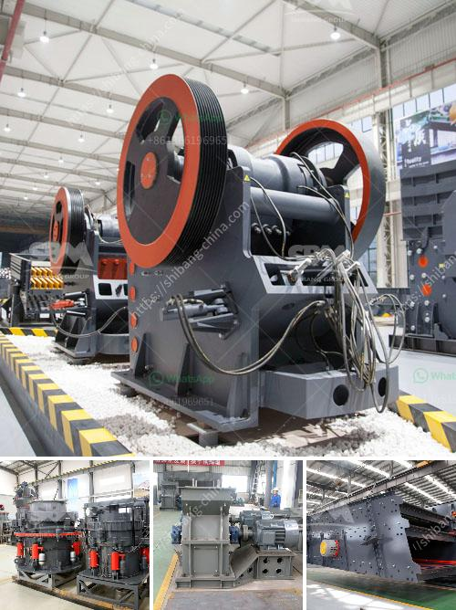

<h3>gypsum crushing machine design pdf</h3>
The invention of the gypsum board production line is a revolution in the gypsum industry. This equipment is highly efficient and reliable, and it has been widely used in various industries. However, due to the complex and diverse structure of gypsum, the crushing process of gypsum is also complicated. In order to solve this problem, this article will introduce the design of a gypsum crushing machine.

The first step in the design of a gypsum crushing machine is to choose the proper gypsum crusher. Nowa---days, there are many types of crushers produced by various manufacturers. Some traditional crushers are designed with movement jaws and static jaws, such as PE jaw crusher and PEW jaw crusher. Others are designed with rotary motion jaws, such as HJ jaw crusher and CJ jaw crusher. These crushers have their own advantages and characteristics, and users can choose according to their actual needs.

After selecting the appropriate crusher, the next step is to design the crushing cavity of the machine. The crushing cavity is the workspace where the material is crushed. The design of the crushing cavity should be reasonable and scientific, which is crucial for the crushing effect. In general, the crushing cavity of the gypsum crushing machine should have a deep and symmetrical chamber. The structure of the chamber should be simplified as much as possible to make the material flow smoothly and avoid material accumulation.

In addition to the crushing cavity, the design of the feeding and discharging system is also important. The feeding system should be designed with a large enough feed opening, which can effectively reduce the resistance of the gypsum entering the crushing cavity and improve the production efficiency. The discharging system should be equipped with a discharge port with adjustable size, so that users can adjust the size of the crushed gypsum according to their requirements.

Furthermore, the design of the complete gypsum crushing machine should also consider the environmental protection and energy saving aspects. The noise and dust pollution generated during the crushing process should be minimized. In addition, the machine should be energy efficient to reduce energy consumption.

In conclusion, the design of a gypsum crushing machine plays a crucial role in the efficient and reliable production of gypsum boards. The selection of the appropriate crusher, the reasonable design of the crushing cavity, and the optimization of the feeding and discharging system are all important factors to consider. Moreover, the environmental protection and energy saving aspects should also be taken into account. With the continuous development of technology, the design of gypsum crushing machines will continue to improve, providing a solid foundation for the development of the gypsum industry.

- Techinke. "Design of the Most Cost-Effective Gypsum Crushing Machine." 2017 Proceedings of the International Conference on Construction and Real Estate Management, 2017.
<h3>Contact us</h3><ul><li><strong>Whatsapp:&nbsp;<a href="https://wa.me/8613661969651">+8613661969651</a></strong></li><li><a href="https://swt.shibang-china.com/?git&amp;zhl&amp;gypsum crushing machine design pdf"><strong>Online Service(chat now)</strong></a></li></ul><h3>Related</h3><ul><li><a href='cameroon quarry crusher.md'>cameroon quarry crusher</a></li><li><a href='crushing plant suppliers in pakistan.md'>crushing plant suppliers in pakistan</a></li><li><a href='stone quarrying stone crusher.md'>stone quarrying stone crusher</a></li><li><a href='crusher price china.md'>crusher price china</a></li><li><a href='buy crusher of pact in peru.md'>buy crusher of pact in peru</a></li></ul>