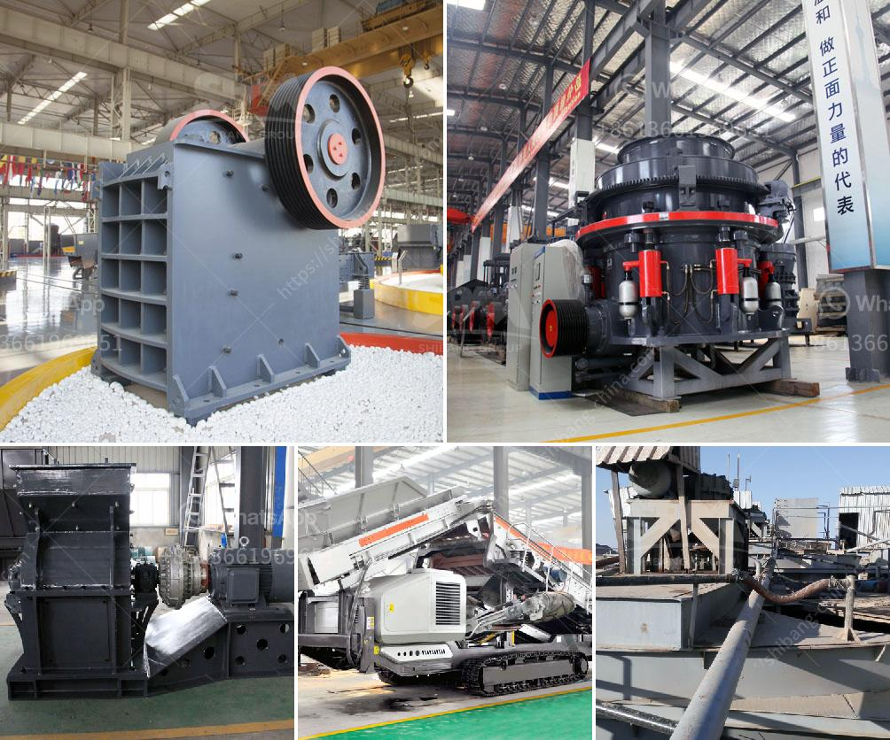

<h3>gypsum crushing machine for sale india</h3>
Gypsum, a mineral deposit composed of calcium sulfate dihydrate (CaSO4·2H2O), is a valuable resource for a variety of purposes, such as manufacturing construction materials, fertilizers, and pharmaceuticals. However, to extract the mineral efficiently, crushing equipment is necessary to break down the sedimentary rock formations into smaller, manageable pieces. In India, the demand for gypsum is steadily rising as construction projects continue to develop across the country. As a result, the need for high-quality gypsum crushing machines has increased, keeping pace with the booming construction industry.

Gypsum crushing machines, commonly known as jaw crushers, are often used in primary, secondary, and tertiary crushing stages. Jaw crushers play an essential role in the mining and construction industry, as they deliver the initial crushing of raw materials. These machines are ideal for coarse and medium crushing, ensuring the production of uniformly sized particles. To accommodate various project requirements, the machines are available in different sizes, allowing users to select the one that best fits their needs.

One key advantage of jaw crushers is their ability to process hard, abrasive materials such as gypsum with ease. The crushing chamber is designed to minimize wear and maximize efficiency, ensuring optimal performance even when dealing with challenging materials. Additionally, the machines are equipped with robust and reliable components, ensuring durability and reducing maintenance requirements. Such longevity allows businesses to continue their operations without frequent interruptions and costly repairs.

In countries like India, where the construction industry is rapidly expanding, the demand for gypsum crushing machines has never been higher. With more infrastructure projects taking place across the country, the need for high-quality gypsum for construction purposes is increasing exponentially. Gypsum crushing machines are integral to the mining and construction industry, as they supply the necessary material for various stages of production.

Undoubtedly, the gypsum crushing machine in India plays an important role in the mining process. As India ranks among the world's largest producers of gypsum, the gypsum crushing machine for sale in India has advanced significantly in terms of production and efficiency. As a leading global manufacturer of crushing equipment, mining machinery companies, such as Zenith, have focused on the production and development of gypsum crushing machines for all mining operators. These machines have been highly praised for their efficiency, reliability, and the overall low cost of ownership.

In addition to the gypsum crushing machine for sale in India, Zenith's gypsum crushers are ideal for crushing gypsum ore in various stages of processing. To ensure maximum efficiency and availability, Zenith provides high-performance gypsum crushers that are reliable and easy to maintain. The impact gypsum crusher is often used as a secondary crusher in a gypsum crushing line. It is characterized by large feed size, small discharge size, and high crushing efficiency. Our gypsum crushing machines are all favored by customers at home and abroad, and they have brought large economic benefits to our customers' processing sites.

In conclusion, gypsum crushing machines play an important role in India's gypsum processing industry. The high quality and technologically advanced gypsum processing machines can benefit the users in various aspects. If you want to learn more about the gypsum crushing machine for sale India, feel free to contact us, we will provide you with the best solution and the most competitive quotation.
<h3>Contact us</h3><ul><li><strong>Whatsapp:&nbsp;<a href="https://wa.me/8613661969651">+8613661969651</a></strong></li><li><a href="https://swt.shibang-china.com/?git&amp;zhl&amp;gypsum crushing machine for sale india"><strong>Online Service(chat now)</strong></a></li></ul><h3>Related</h3><ul><li><a href='clay grinder machine kerala.md'>clay grinder machine kerala</a></li><li><a href='copper crusher plant for sale chile.md'>copper crusher plant for sale chile</a></li><li><a href='rock crusher for crushing balsalt stone.md'>rock crusher for crushing balsalt stone</a></li><li><a href='correct feed of cone crushers.md'>correct feed of cone crushers</a></li><li><a href='diatomite grinding mill in indonesia.md'>diatomite grinding mill in indonesia</a></li></ul>