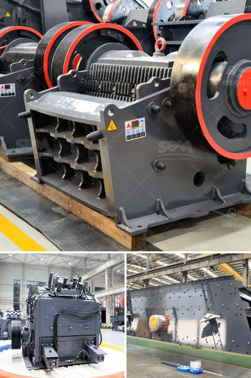

<h3>gypsum crushing process</h3>
Gypsum is a widely used industrial material and building material. Gypsum (CaSO4·2H2O) can be used as a raw material for the production of gypsum products such as gypsum board, gypsum ceiling tiles, gypsum blocks, gypsum plaster, and plaster of Paris.

In the construction industry, gypsum is used primarily as a binder for building materials such as cement, gypsum board, and plaster. Gypsum is a mineral that belongs to the family of calcium sulphate hydrates. It is commonly used in drywall and plasterboard, helping to control the spread of fire in buildings.

The first step in the process of gypsum crushing is to undertake ore minerals such as limestone, calcium carbonate, dolomite, sulphate of potash, and rocks such as granite, quartzite and basalt. Extracted ore materials are transported to the crushing plant for further size reduction.

The primary crushing process reduces the raw gypsum material from a large size into smaller particles suitable for further processing. Depending on the size of the raw gypsum material, the crushers can be divided into jaw crusher, impact crusher, cone crusher, and vertical shaft impact crusher.

The gypsum crushing process can be operated in a variety of configurations and stages based on the needs of the customer. For example, a secondary crusher reduces the material to a smaller size to allow further processing such as screening and grinding. The secondary crusher is followed by a screening process that sifts out materials of the desired size.

The materials are then transported to the grinding mill for further grinding and processing. The ground gypsum powder is sorted and sent to the boiling furnace for calcination, and the unqualified materials are returned to the grinding mill for re-grinding.

After calcination, the gypsum powder is transported to the storage silo or product workshop for packaging, and the remaining gas and powder are collected through the dust collector and sent to the exhaust gas purification system to remove impurities.

The entire gypsum crushing process can be fully automated and remotely controlled to ensure maximum efficiency and productivity. The use of advanced equipment and machinery, such as a dust control system, ensures that the working environment is safe and clean.

In conclusion, the gypsum crushing process involves several stages, including extraction, primary crushing, secondary crushing, grinding, calcination, storage, and packaging. This process provides a high-quality gypsum product utilized in various industries and construction applications. It is important to follow strict guidelines and safety measures to ensure the production of a high-quality and safe product.
<h3>Contact us</h3><ul><li><strong>Whatsapp:&nbsp;<a href="https://wa.me/8613661969651">+8613661969651</a></strong></li><li><a href="https://swt.shibang-china.com/?git&amp;zhl&amp;gypsum crushing process"><strong>Online Service(chat now)</strong></a></li></ul><h3>Related</h3><ul><li><a href='ball mill particle size in micrometets.md'>ball mill particle size in micrometets</a></li><li><a href='total process of gypsum powder plant.md'>total process of gypsum powder plant</a></li><li><a href='graphite powder processing equipment.md'>graphite powder processing equipment</a></li><li><a href='ball mill price list philippines.md'>ball mill price list philippines</a></li><li><a href='gold wash plant price in nigeria.md'>gold wash plant price in nigeria</a></li></ul>