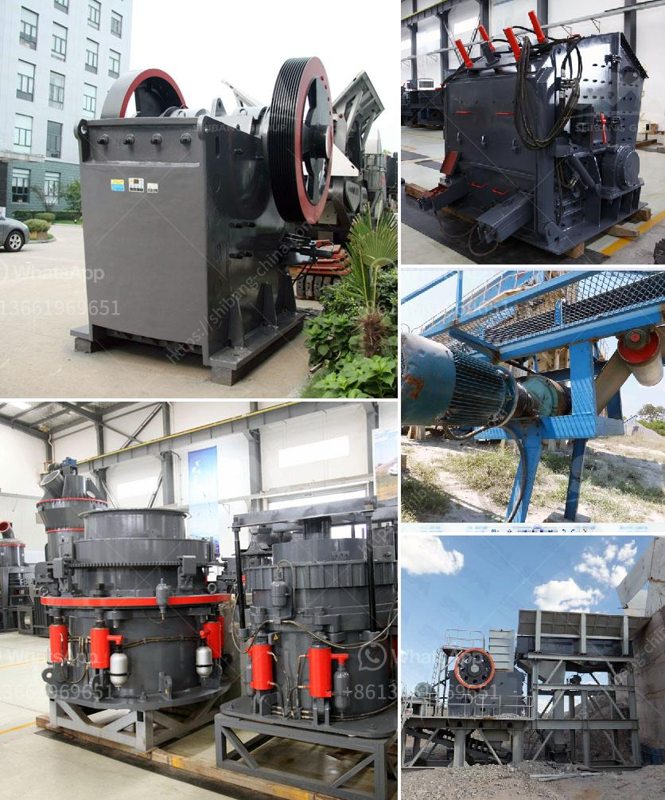

<h3>gypsum furnace for boiling</h3>
Gypsum, also known as calcium sulfate, plays a crucial role in various industries, including construction, agriculture, and the chemical sector. This versatile mineral is commonly used in the production of cement, plaster, and fertilizer, just to name a few applications. To obtain high-quality gypsum, manufacturers utilize a gypsum furnace for boiling, which efficiently converts raw gypsum into a usable form.

A gypsum furnace for boiling is a specialized equipment that uses heat to transform raw gypsum into a semi-hydrated product known as plaster of Paris. This process involves heating the gypsum at a specific temperature to evaporate the water content, leaving behind the desired form of gypsum.

One of the key advantages of using a gypsum furnace for boiling is its efficiency. The furnace is designed to reach and maintain the optimal temperature to achieve the desired results. This ensures that the gypsum is thoroughly heated, allowing for maximum removal of moisture. Additionally, modern gypsum furnaces are equipped with advanced control systems that enable precise temperature management, ensuring the consistency and quality of the final product.

Sustainability is another major benefit of utilizing a gypsum furnace for boiling. The process of boiling gypsum consumes significantly less energy compared to other methods, resulting in reduced carbon emissions. The gypsum industry has long been conscious of its environmental impact and has made substantial efforts to minimize it. By embracing energy-efficient technologies such as gypsum furnaces, manufacturers can further contribute towards a sustainable and greener future.

Furthermore, a gypsum furnace for boiling offers enhanced safety features. These furnaces are equipped with advanced sensors and alarms that monitor temperature, pressure, and other critical parameters, preventing any potential hazards. This ensures the safety of both the equipment and the operators, minimizing the risk of accidents and creating a secure working environment.

The use of a gypsum furnace for boiling also allows for greater flexibility in production. Manufacturers can adjust the heating process to meet specific requirements, such as different levels of plaster of Paris or gypsum powder. The furnace's versatility enables customization, ensuring that the final product meets the exact specifications of customers and end-users.

In addition to its technical advantages, a gypsum furnace for boiling also offers economic benefits. By optimizing the boiling process, manufacturers can increase productivity and reduce production costs. The equipment's precise control systems enable efficient energy usage, resulting in lower operating expenses. These cost savings can be passed on to consumers, making gypsum-based products more accessible and affordable.

In conclusion, a gypsum furnace for boiling is an efficient, sustainable, and safe solution for transforming raw gypsum into usable forms such as plaster of Paris. It offers precise temperature control, ensuring optimum results while minimizing energy consumption and carbon emissions. The versatility of the equipment allows for customization, providing tailored gypsum products to meet specific industry and customer demands. Furthermore, the economic benefits of using a gypsum furnace make it an attractive choice for manufacturers, ultimately benefiting consumers. As the demand for gypsum-based products continues to grow, investing in advanced gypsum furnaces for boiling is an excellent step towards a more sustainable and prosperous future.
<h3>Contact us</h3><ul><li><strong>Whatsapp:&nbsp;<a href="https://wa.me/8613661969651">+8613661969651</a></strong></li><li><a href="https://swt.shibang-china.com/?git&amp;zhl&amp;gypsum furnace for boiling"><strong>Online Service(chat now)</strong></a></li></ul><h3>Related</h3><ul><li><a href='lime grinding machine manufacturer in kolhapur.md'>lime grinding machine manufacturer in kolhapur</a></li><li><a href='coal making process.md'>coal making process</a></li><li><a href='quarry stone crusher machine.md'>quarry stone crusher machine</a></li><li><a href='china crushing plant.md'>china crushing plant</a></li><li><a href='crushing plant limestone.md'>crushing plant limestone</a></li></ul>