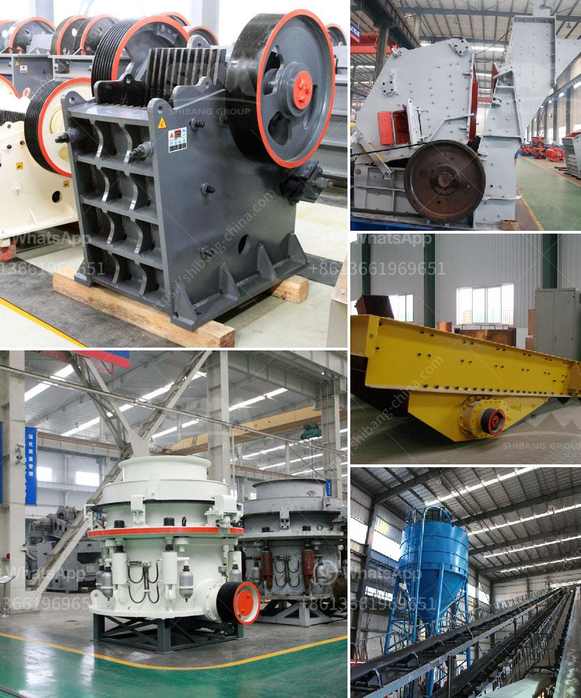

<h3>gypsum grinding machine plant</h3>
Gypsum is a mineral that’s used in manufacturing materials such as wallboard, cement, and plaster. It’s also used as a soil additive and fertilizer. Gypsum grinding machine is commonly used in industrial factories and mining operations. It’s an essential tool for grinding, crushing, and grinding various materials into powder for further processing.

A gypsum grinding machine plant is a mechanical device used to grind gypsum from large raw material chunks into small granules or powder. It’s called a grinding machine because it performs the function of grinding gypsum for different applications. With the increasing demand for gypsum products, manufacturers have developed various grinding machines to meet the needs of different industries.

In a gypsum grinding machine plant, the gypsum material is crushed between fixed jaws and moving jaws. The gypsum is then fed into the grinding chamber, where it’s ground into a fine powder by the rotating grinding wheel. The powder is collected by a cyclone separator or a dust collector, depending on the specific setup of the plant. The final product is gypsum powder, which can be used for various purposes.

One of the popular gypsum grinding machines used in the industry is the Raymond mill. This machine has a vertical structure with a small footprint. It features advanced technology and is equipped with efficient dust removal and noise reduction systems.

The Raymond mill is designed to grind gypsum efficiently and economically. It can grind different types of gypsum, such as natural gypsum, phosphogypsum, desulfurized gypsum, and FGD gypsum. The final product has a uniform fineness and meets the requirements of various industries.

Other types of gypsum grinding machines include ball mills, hammer mills, and vertical roller mills. Each type has its unique features and advantages. For example, ball mills are suitable for grinding large pieces of gypsum into a fine powder. Hammer mills are ideal for grinding small particles of gypsum into powder. Vertical roller mills are perfect for grinding gypsum with high humidity and high hardness.

A gypsum grinding machine plant can produce many benefits for its users. For example, it can reduce the cost of handling and transportation of gypsum material. The grinding machine can also improve the utilization rate of gypsum resources, thereby reducing waste and environmental pollution.

Furthermore, a gypsum grinding machine plant can produce high-quality gypsum powder, which can be used in a wide range of applications. Gypsum powder is commonly used in construction materials, such as wallboard, cement, and plaster. It can also be used as a soil additive to improve soil fertility and water retention.

In conclusion, a gypsum grinding machine plant plays a crucial role in the gypsum processing industry. It’s a reliable tool for grinding gypsum into powder for various applications. Whether it’s used in the manufacturing of construction materials or as a soil additive, a gypsum grinding machine plant helps optimize the utilization of gypsum resources and promotes sustainable development.
<h3>Contact us</h3><ul><li><strong>Whatsapp:&nbsp;<a href="https://wa.me/8613661969651">+8613661969651</a></strong></li><li><a href="https://swt.shibang-china.com/?git&amp;zhl&amp;gypsum grinding machine plant"><strong>Online Service(chat now)</strong></a></li></ul><h3>Related</h3><ul><li><a href='advantech grinding mill india.md'>advantech grinding mill india</a></li><li><a href='mobile jaw crusher for sale south africa.md'>mobile jaw crusher for sale south africa</a></li><li><a href='cost of used crusher for granite.md'>cost of used crusher for granite</a></li><li><a href='stone powder machine.md'>stone powder machine</a></li><li><a href='crusher manufactures in europe.md'>crusher manufactures in europe</a></li></ul>