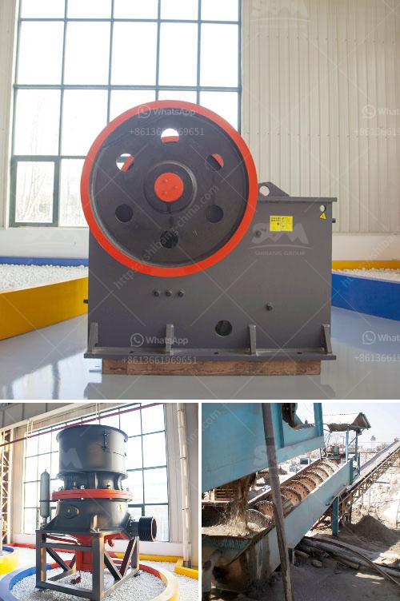

<h3>gypsum grinding mill for chalk factory</h3>
Chalk has been used for centuries as a writing tool, and it continues to be a popular choice in classrooms, offices, and even at home. However, not all chalk is created equal. The quality of chalk largely depends on its composition, and one crucial component is gypsum. This is where a gypsum grinding mill plays a vital role in enhancing chalk quality for a chalk factory.

Gypsum, commonly known as calcium sulfate dihydrate (CaSO4·2H2O), is a soft mineral that occurs naturally in sedimentary rock formations. It has a plethora of uses, and one of them is in the production of high-quality chalk. Gypsum is added during the manufacturing process to improve the smoothness, hardness, and opacity of chalk, making it easier to write with and erasable without leaving behind residue.

A gypsum grinding mill is an essential tool for gypsum powder production. It grinds the gypsum into fine particles that are ready to be mixed with other materials to produce high-quality chalk. The grinding mill is at the heart of a chalk factory's operations, and its efficiency and performance directly impact the overall quality of the chalk produced.

Modern gypsum grinding mills are equipped with advanced technology, allowing for precise and controlled grinding. The mills use rotating hammers or rollers that crush and grind the gypsum, reducing it to the desired particle size. This consistency in particle size ensures uniformity and homogeneity of the chalk once it is formed.

Furthermore, a gypsum grinding mill can also improve the whiteness and brightness of chalk. By finely grinding the gypsum, the mill helps to break down any impurities or discoloration, resulting in a purer and brighter chalk. This is particularly important for chalk used on blackboards or other dark surfaces.

In conclusion, a gypsum grinding mill is a crucial piece of equipment for any chalk factory. It enhances the quality of chalk by grinding gypsum into fine particles, improving its smoothness, hardness, and opacity. The mill's efficiency and precision directly impact the overall quality of the chalk produced, ensuring uniformity in particle size and enhancing whiteness and brightness. With the help of advanced technology, modern gypsum grinding mills play a vital role in producing high-quality chalk for various applications, making them indispensable for chalk factory operations.
<h3>Contact us</h3><ul><li><strong>Whatsapp:&nbsp;<a href="https://wa.me/8613661969651">+8613661969651</a></strong></li><li><a href="https://swt.shibang-china.com/?git&amp;zhl&amp;gypsum grinding mill for chalk factory"><strong>Online Service(chat now)</strong></a></li></ul><h3>Related</h3><ul><li><a href='sale 42 jaw crusher in india.md'>sale 42 jaw crusher in india</a></li><li><a href='crushed gravel supplier in negros oriental.md'>crushed gravel supplier in negros oriental</a></li><li><a href='100 tph cobble crushing plant.md'>100 tph cobble crushing plant</a></li><li><a href='crushing plant in montalban.md'>crushing plant in montalban</a></li><li><a href='ballast making machine for sale.md'>ballast making machine for sale</a></li></ul>