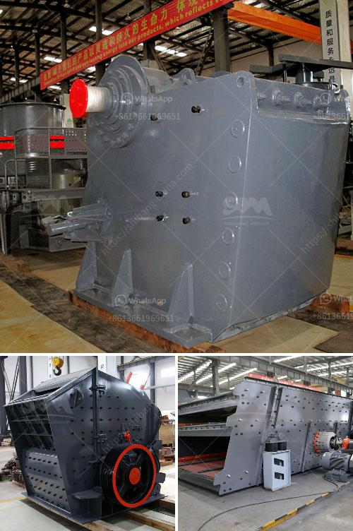

<h3>gypsum manufacturing plant from turkey</h3>
Turkey is renowned for its vast deposits of gypsum, a mineral that has various valuable uses in different industries. With a global ranking of second in gypsum production and an abundant supply of high-quality gypsum, Turkey offers immense opportunities for manufacturers and exporters. Among the leading gypsum manufacturers in Turkey is [Company Name], operating one of the largest gypsum manufacturing plants in the country.

[Company Name] has been at the forefront of gypsum production for over [number of years], producing a wide range of gypsum-based products tailored to meet the diverse needs of customers across various industries. Their manufacturing plant utilizes state-of-the-art technology to ensure efficient and sustainable production processes.

Gypsum, a naturally occurring mineral, is primarily used in the construction industry to make drywall, cement, and plaster. However, its applications extend far beyond construction, finding usage in agriculture, medicine, food, and even art. Considering its versatility, [Company Name] has positioned itself to cater to an array of markets and deliver customized products.

The gypsum manufacturing process starts with the extraction of gypsum ore from the mines. The extracted ore is then transported to the manufacturing plant, where it undergoes a series of processing steps. These steps include crushing, grinding, calcination, cooling, and storage. Each process is carefully controlled to ensure the desired quality and consistency of the final product.

In the initial stage of crushing, the gypsum ore is reduced in size and subjected to grinding. This process ensures the uniform distribution of gypsum particles, enhancing its flowability and workability. The crushed and ground gypsum is then sent for calcination, where it is heated at high temperatures to remove its water content. This results in the formation of calcium sulfate hemihydrate, which is commonly known as plaster of Paris.

After calcination, the gypsum is rapidly cooled and stored in specialized silos. The cooled material is then milled to achieve the desired fineness, ensuring optimal performance in its intended application. Additionally, [Company Name] implements comprehensive quality control measures at every stage of the manufacturing process to guarantee consistency in product quality and meet international standards.

One of the key advantages of [Company Name] is its ability to provide custom-tailored gypsum products to suit specific customer requirements. The plant is equipped with advanced laboratory facilities staffed by experienced technicians, allowing for precise product testing and formulation. This enables [Company Name] to develop gypsum-based solutions that cater to specific construction needs, such as fire resistance, sound insulation, and moisture resistance.

Moreover, [Company Name]'s commitment to sustainability and environmental responsibility is reflected in their manufacturing process. The plant employs technologies to minimize energy consumption and waste generation, ensuring a minimal environmental footprint. These eco-friendly practices align with global efforts to reduce carbon emissions and promote sustainable manufacturing.

In conclusion, the gypsum manufacturing plant from Turkey, operated by [Company Name], embodies a commitment to excellence, sustainability, and customer satisfaction. With its advanced production processes, customization capabilities, and adherence to environmental standards, it has positioned itself as a leading player in the gypsum industry. Furthermore, Turkey's abundant gypsum resources make it an ideal location for manufacturing plants, fostering growth and promoting exports in this sector.
<h3>Contact us</h3><ul><li><strong>Whatsapp:&nbsp;<a href="https://wa.me/8613661969651">+8613661969651</a></strong></li><li><a href="https://swt.shibang-china.com/?git&amp;zhl&amp;gypsum manufacturing plant from turkey"><strong>Online Service(chat now)</strong></a></li></ul><h3>Related</h3><ul><li><a href='copper crusher manufacturer.md'>copper crusher manufacturer</a></li><li><a href='portable cedar rapids rock crusher.md'>portable cedar rapids rock crusher</a></li><li><a href='crusher price of nigeria.md'>crusher price of nigeria</a></li><li><a href='mobile crusher plants.md'>mobile crusher plants</a></li><li><a href='ball mill 25 tons per hour price.md'>ball mill 25 tons per hour price</a></li></ul>