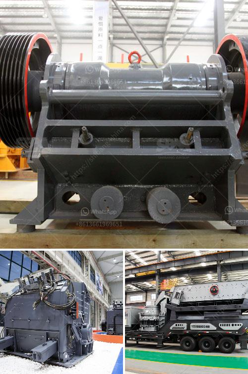

<h3>gypsum mines in pakistan</h3>
Gypsum is a mineral found in sedimentary rock formations in many parts of Pakistan. Gypsum is a common mineral and is used in many industrial applications due to its durability and versatility. Specifically, gypsum is a vital ingredient in cement production, as it helps in the binding of materials to form a hard matrix. Moreover, gypsum is also commonly used in the construction industry for making drywall and plaster products.

Pakistan is blessed with an abundant reserve of gypsum, scattered in various regions across the country. The major gypsum mines are located in Punjab, Sindh, Balochistan, and Khyber Pakhtunkhwa provinces, ensuring a steady supply of this valuable mineral for industrial and construction purposes.

One of the largest and oldest gypsum mines in Pakistan is the Daud Khel Mine in Khyber Pakhtunkhwa. This mine is renowned for its high-quality gypsum and vast reserves, making it a significant contributor to the country's gypsum production. The Daud Khel Mine has been operational for many years and has played a crucial role in meeting the growing demand for gypsum in Pakistan's construction industry.

The father of modernism, Louis Kahn, even recognized the importance of the Daud Khel Mine's gypsum. He incorporated this gypsum into the design of the iconic National Assembly Building in Islamabad, showcasing Pakistan's rich natural resources and promoting a sense of national identity.

Gypsum extraction in Pakistan has both positive and negative impacts on the local communities and the environment. On one hand, the mining sector has helped in providing employment opportunities to the locals, reducing poverty, and stimulating economic growth in the surrounding areas. This has led to increased infrastructure development, improved access to education and healthcare facilities, and better living standards for the communities living near gypsum mines.

On the other hand, gypsum mining also poses some challenges. The extraction process can lead to environmental degradation, including deforestation, soil erosion, and water pollution. Companies involved in gypsum mining are increasingly aware of these issues and are taking measures to mitigate their impact. Sustainable mining practices, land reclamation, and environmental assessments are being implemented to minimize the negative effects on the environment and ensure sustainable resource management.

Furthermore, it is crucial for the government to regulate the gypsum mining sector effectively. Providing oversight and implementing policies that address environmental concerns, ensure fair labor practices, and protect the rights of affected communities is essential for sustainable and responsible mining.

In conclusion, gypsum mines in Pakistan serve as a vital resource for the country's construction and industrial sectors. The availability of this mineral in various regions of Pakistan, including the renowned Daud Khel Mine, has contributed significantly to the economic development of the country. However, sustainable mining practices and effective regulations are essential to balance the economic benefits with environmental preservation and the well-being of local communities.
<h3>Contact us</h3><ul><li><strong>Whatsapp:&nbsp;<a href="https://wa.me/8613661969651">+8613661969651</a></strong></li><li><a href="https://swt.shibang-china.com/?git&amp;zhl&amp;gypsum mines in pakistan"><strong>Online Service(chat now)</strong></a></li></ul><h3>Related</h3><ul><li><a href='list of equipment used in iron ore mining.md'>list of equipment used in iron ore mining</a></li><li><a href='barite powder making.md'>barite powder making</a></li><li><a href='coal screen plant for hire in south africa.md'>coal screen plant for hire in south africa</a></li><li><a href='cost of 150tph cement grinding plant.md'>cost of 150tph cement grinding plant</a></li><li><a href='manufacturing of marble and granite crusher machines.md'>manufacturing of marble and granite crusher machines</a></li></ul>