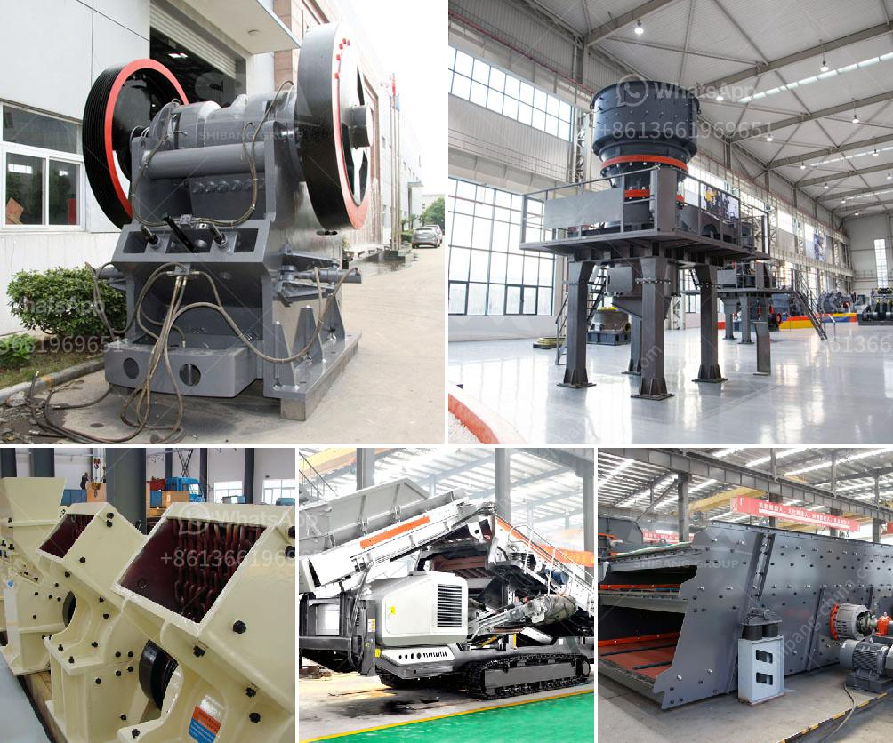

<h3>gypsum mining crusher dubai</h3>
Gypsum, a mineral resource with a variety of uses, has been a staple of many industries for centuries. From drywall and cement production to agricultural applications, gypsum is a valuable resource that offers numerous benefits. In Dubai, the booming construction industry relies heavily on gypsum for various applications, making gypsum mining crusher an essential piece of machinery.

As gypsum is widely used in construction, there is a growing demand for gypsum mining crusher. Dubai is rich in gypsum resources. With the construction of high-rise buildings and skyscrapers soaring, demand for gypsum has increased exponentially. In addition to supplying raw materials to the bustling construction industry, gypsum mining crusher Dubai also supplies mineral resources to the cement, furniture, and agricultural industries.

Gypsum mining crusher Dubai is the main equipment for gypsum mining, and crushing gypsum raw materials are transformed into particles of the desired size with the help of various crushers, screening equipment, and conveyors. It is required in many industries, such as mining, metallurgy, road construction, and chemical industry.

Gypsum mining crusher Dubai includes vibrating feeder, jaw crusher, impact crusher or cone crusher, and vibrating screen. The gypsum crusher is compact, lightweight, easy to install, and easy to operate. It can crush large-sized gypsum ore into small particles less than 25mm.

Gypsum mining crusher Dubai is the crusher equipment designed for gypsum mining crushers have a good market in Dubai, and we provide a variety of high-quality mining equipment and crusher wear parts sold by UAE dealers, such as imported crushers, jaw crushers, and cone crushers.

In conclusion, gypsum mining crusher Dubai is an important equipment in the production of gypsum, and plays a crucial role in the processing and crushing of raw gypsum. As the gypsum market continues to boom in Dubai and the wider Middle East, demand for gypsum mining crusher increases. However, ensuring a reliable and efficient operation of these machines is crucial for optimizing production and reducing costs.
<h3>Contact us</h3><ul><li><strong>Whatsapp:&nbsp;<a href="https://wa.me/8613661969651">+8613661969651</a></strong></li><li><a href="https://swt.shibang-china.com/?git&amp;zhl&amp;gypsum mining crusher dubai"><strong>Online Service(chat now)</strong></a></li></ul><h3>Related</h3><ul><li><a href='rent portable concrete crusher in los angeles.md'>rent portable concrete crusher in los angeles</a></li><li><a href='stone crusher powder which products in use in philippines.md'>stone crusher powder which products in use in philippines</a></li><li><a href='series capacitor for crushing plant.md'>series capacitor for crushing plant</a></li><li><a href='ball mill fly ash.md'>ball mill fly ash</a></li><li><a href='stone crusher pe 250x400.md'>stone crusher pe 250x400</a></li></ul>