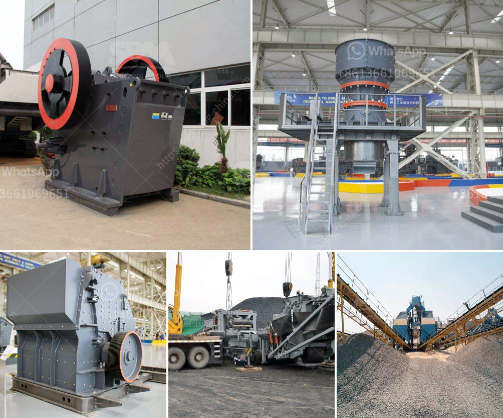

<h3>gypsum plants in india</h3>
India, with its rich reserves of the mineral gypsum, has been a major producer and exporter of this important industrial commodity. The country’s gypsum industry plays a crucial role in fulfilling the demand for both domestic consumption and exports. In this article, we will explore the significance of gypsum plants in India and their contribution to various sectors.

Gypsum, a soft sulfate mineral composed of calcium sulfate dihydrate, has several valuable properties that make it a sought-after industrial material. First and foremost, gypsum is known for its fire-resistant properties, making it an excellent choice for construction materials and fire-resistant barriers. It is widely used in the production of plaster of Paris, wallboard, cement, and even fertilizer.

India boasts substantial reserves of gypsum, predominantly found in Rajasthan. The state alone accounts for more than 70% of the country's total gypsum production. Other regions in the country, such as Tamil Nadu, Gujarat, and Jammu & Kashmir, also contribute to the nation’s gypsum output.

Gypsum plants in India leverage these reserves and convert them into various forms of gypsum, including raw gypsum, gypsum powder, and gypsum plaster. Furthermore, gypsum plants in India are also active in adding value to the gypsum resources that they extract by providing various products and services to the construction industry.

The gypsum industry in India has a significant impact on the economy. It creates employment opportunities directly and indirectly, ranging from gypsum extraction to transportation, production, and end-use applications. The industry also contributes to the country's export earnings by catering to the global market demand.

One of the main applications of gypsum in India is in the construction sector. Gypsum plaster, commonly known as plaster of Paris (POP), is extensively used for interior wall plastering. The smooth and crack-resistant surface it provides makes it a popular choice among builders, architects, and homeowners. Additionally, gypsum board, also known as drywall or partition board, is widely used in the construction of walls and ceilings due to its lightweight nature and ease of installation.

The Indian agriculture sector is another major consumer of gypsum. Gypsum improves the soil structure, enhances water retention capacity, and promotes the growth of healthy and disease-resistant crops. It is particularly beneficial in regions with high alkalinity or salinity, as it helps reclaims such soils, making them suitable for cultivation.

Recently, gypsum plants in India have witnessed an upsurge in demand due to the growing popularity of organic farming practices. Gypsum acts as a soil conditioner in organic farming, aiding in the rejuvenation of exhausted soils from nutrient depletion caused by continuous cultivation.

Moreover, gypsum has applications in industries such as cement, fertilizers, and ceramics. In the cement industry, gypsum is used as an additive to control the setting time of concrete and improve its workability. In the ceramic industry, gypsum helps regulate the drying and firing process, ensuring better quality and reduced energy consumption.

In conclusion, gypsum plants in India play a vital role in the utilization of the country's rich gypsum reserves. These plants not only meet the domestic requirements but also contribute significantly to the global demand for gypsum. The multi-faceted applications of gypsum in various industries make it a versatile mineral with immense economic and environmental benefits. The continued growth of gypsum plants in India is crucial to sustain the nation's developmental aspirations and catalyze the progress of key sectors that rely on this indispensable mineral.
<h3>Contact us</h3><ul><li><strong>Whatsapp:&nbsp;<a href="https://wa.me/8613661969651">+8613661969651</a></strong></li><li><a href="https://swt.shibang-china.com/?git&amp;zhl&amp;gypsum plants in india"><strong>Online Service(chat now)</strong></a></li></ul><h3>Related</h3><ul><li><a href='tons per hour ball mill for sale in south africa.md'>tons per hour ball mill for sale in south africa</a></li><li><a href='buy used crushing coal screen plant.md'>buy used crushing coal screen plant</a></li><li><a href='span of rock crusher equipment.md'>span of rock crusher equipment</a></li><li><a href='limestone crisher machine for sale in cebu.md'>limestone crisher machine for sale in cebu</a></li><li><a href='chrome beneficiation plant china.md'>chrome beneficiation plant china</a></li></ul>