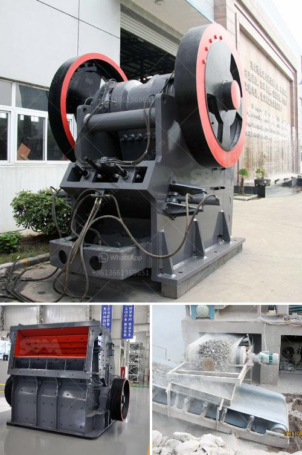

<h3>gypsum powder ball mill machinery</h3>
Gypsum powder has been widely used in many fields. The mining machinery used in gypsum powder production line mainly includes gypsum crusher, gypsum grinding mill, gypsum powder dryer, gypsum screening equipment, gypsum powder packing machine and so on.

Gypsum powder ball mill, also known as the gypsum grinding machine, is widely used in the grinding process of gypsum ore in the production and processing of gypsum powder. The gypsum powder ball mill can be widely used in cement, silicate products, new building materials, refractory materials, fertilizers, black and non-ferrous metal dressings and glass ceramics, etc., with significant grinding effect and high grinding efficiency. The gypsum powder ball mill has a stable operation and reliable performance.

1. High capacity and low consumption: The capacity of the gypsum powder ball mill is twice as much as that of the air flow mill, the mixing grinder and the ball mill, and the energy consumption is reduced by 30%.

2. Long service life and low maintenance cost: The grinding roller and the grinding ring are forged with special materials, which greatly improves the utilization and service life of the machine. The wearing parts are made of high-quality wear-resistant materials and have a long service life.

3. High grinding efficiency: The gypsum powder ball mill adopts continuous operation method, which greatly reduces the downtime and improves the grinding efficiency. It is equipped with advanced dust removal system, which can effectively remove the impurities in the air to ensure the clean and green production environment.

4. Easy to control and operate: The gypsum powder ball mill has a precise control system, which can automatically adjust and control the grinding speed, the fineness of the finished product and other parameters according to the actual production needs. With simple operation and convenient maintenance, it can greatly reduce the labor intensity of workers.

In addition to the above advantages, the gypsum powder ball mill machinery produced by our company also has many other superior performances. It has been widely used in the grinding of gypsum ore in the fields of construction, building materials, power plant desulfurization, metallurgy, chemical industry, non-metallic minerals and so on.

As a professional manufacturer of mining machinery, our company has a complete range of gypsum powder ball mill machinery, and our gypsum powder ball mill price is favorable. We have exported to many countries and regions around the world, and have received unanimous praise from customers. If you want to know more about our gypsum powder ball mill machinery or have any questions, please feel free to contact us. We are always ready to provide you with sincere service and professional solutions.
<h3>Contact us</h3><ul><li><strong>Whatsapp:&nbsp;<a href="https://wa.me/8613661969651">+8613661969651</a></strong></li><li><a href="https://swt.shibang-china.com/?git&amp;zhl&amp;gypsum powder ball mill machinery"><strong>Online Service(chat now)</strong></a></li></ul><h3>Related</h3><ul><li><a href='hammer mill rock crusher.md'>hammer mill rock crusher</a></li><li><a href='crusher in argentina stone crusher.md'>crusher in argentina stone crusher</a></li><li><a href='types of roller mill.md'>types of roller mill</a></li><li><a href='manufacturing process of plaster of paris china.md'>manufacturing process of plaster of paris china</a></li><li><a href='small crusher project.md'>small crusher project</a></li></ul>