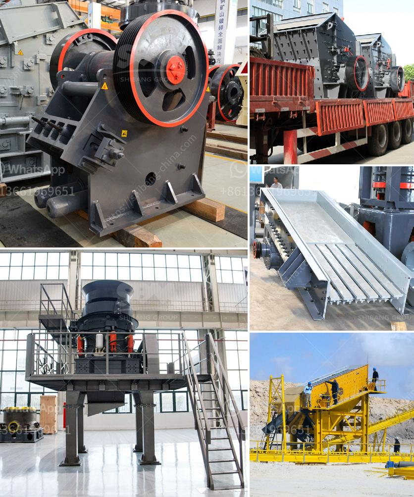

<h3>gypsum powder designed</h3>
Gypsum powder, often known as plaster of Paris, is a widely used building material that offers excellent fire resistance, sound insulation, and moisture resistance. It is created by heating gypsum, a natural mineral found in sedimentary rocks, to remove the water content, resulting in a fine white powder. This versatile material has been utilized in construction for centuries due to its numerous benefits and easy application process.

One of the primary characteristics of gypsum powder is its ability to contribute to fire resistance. When exposed to high temperatures, gypsum does not catch fire but instead releases water vapor, which helps to hinder the spread of flames. This quality has made it a popular choice for insulation and protective barriers in both residential and commercial buildings. In addition, gypsum boards made from this powder are widely used in the construction of false ceilings, partitions, and wall linings due to their exceptional fire-resistant properties.

Furthermore, gypsum powder offers excellent sound insulation properties, making it ideal for noise reduction in various settings. The mineral's porous structure allows it to absorb sound vibrations, thus reducing noise transmission between adjoining rooms or floors. This quality makes it a desirable material for use in auditoriums, recording studios, theaters, and residential buildings where privacy and peace are crucial.

Another compelling feature of gypsum powder is its ability to resist moisture efficiently. Due to its calcium sulfate composition, gypsum effectively absorbs and releases moisture, preventing the growth of mold and mildew. This moisture-resistant property makes it an ideal choice for bathroom walls and ceilings, as well as in areas prone to high humidity such as basements. By inhibiting the development of these harmful microorganisms, gypsum powder helps maintain a healthy and dry environment, preventing potential health issues and structural damage.

The application of gypsum powder is relatively simple and cost-effective. To create gypsum boards or plaster, the powder is mixed with water, forming a workable paste. This paste can then be easily molded into desired shapes or applied directly onto surfaces. Once the gypsum dries, it hardens into a durable material that can be painted or coated to achieve the desired aesthetic. Its versatility allows for a broad range of applications, including decorative moldings, ornamental sculptures, wall finishes, and cornices.

In conclusion, gypsum powder is an essential building material that offers numerous advantages in construction. Its fire-resistant, sound-insulating, and moisture-resistant properties make it suitable for a variety of applications, ensuring safety, comfort, and durability in buildings. The ease of use and affordable cost further enhance its appeal to builders and architects. Whether it is used for creating beautiful designs or enhancing structural integrity, gypsum powder remains a valuable resource in the construction industry.
<h3>Contact us</h3><ul><li><strong>Whatsapp:&nbsp;<a href="https://wa.me/8613661969651">+8613661969651</a></strong></li><li><a href="https://swt.shibang-china.com/?git&amp;zhl&amp;gypsum powder designed"><strong>Online Service(chat now)</strong></a></li></ul><h3>Related</h3><ul><li><a href='second hand jaw crusher for sale in malaysia.md'>second hand jaw crusher for sale in malaysia</a></li><li><a href='ball mill manufacturers in korea.md'>ball mill manufacturers in korea</a></li><li><a href='list of equipment used in iron ore mining.md'>list of equipment used in iron ore mining</a></li><li><a href='ethiopia cone crusher for sale.md'>ethiopia cone crusher for sale</a></li><li><a href='gypsum production line flow chart.md'>gypsum production line flow chart</a></li></ul>