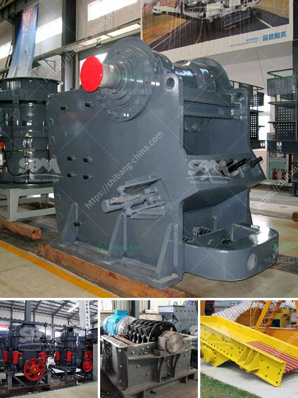

<h3>gypsum powder making plant</h3>
Gypsum powder is a versatile and widely-used material in the construction industry. Today, with the booming construction industry, building materials are in high demand. Gypsum powder is used to make various materials such as drywall, cement, plaster, and even fertilizer. This article will introduce the gypsum powder making plant and explain how the process of making gypsum powder.

Gypsum is a sedimentary rock that is commonly found in massive beds or layers. It is composed of calcium sulfate dihydrate, which is a soft and lightweight mineral. The process of extracting gypsum rock from the ground starts with the mining process. The collected gypsum rock is then transported to the gypsum powder plant for further processing.

The next step in the process is the crushing and grinding of the gypsum ore. The crushed gypsum is screened and then sent to a grinding machine. The ground gypsum powder is blown into the fluidized bed furnace and then calcined at a temperature of about 450 degrees Celsius to achieve complete dehydration. The obtained semi-hydrated gypsum powder is sent to the storage bin through the air flow, and then a pneumatic valve is used to send the powder to the upper part of the boiling furnace for calcination.

Calcination is the most critical step in the production of gypsum powder. During this process, the raw gypsum is heated at a high temperature to remove the excess water present in its composition. This results in the formation of calcium sulfate hemihydrate, commonly known as plaster of Paris. The calcined gypsum powder is then ready to be processed further.

The next step is grinding the calcined gypsum powder into a fine powder. The gypsum powder can be further processed into various products such as plasterboard and gypsum blocks used for construction purposes. The powdered gypsum is mixed with water and additives to form a slurry, which is then poured into a mold or cast to create specific shapes. Once the slurry sets and dries, it hardens into a solid material.

The gypsum powder making plant is equipped with advanced technology and high-quality equipment, ensuring reliable operation and efficient production. The plant is designed to process gypsum board manufacturing with a production capacity of 12 million square meters per year.

The gypsum powder plant is environmentally friendly, utilizing dust collection systems to minimize emissions. It also includes a waste heat recovery system, which further reduces the energy consumption of the plant. Additionally, the plant utilizes modern automation systems to optimize production efficiency and reduce labor costs.

In conclusion, the gypsum powder making plant plays a crucial role in the production of gypsum-based materials used in construction. The process involves crushing, grinding, calcination, and further processing of gypsum to produce high-quality gypsum powder. The plant is designed to be efficient, environmentally friendly, and capable of meeting the demands of the booming construction industry. With the increasing demand for gypsum-based materials, the gypsum powder making plant is poised to contribute significantly to the construction industry's growth and development.
<h3>Contact us</h3><ul><li><strong>Whatsapp:&nbsp;<a href="https://wa.me/8613661969651">+8613661969651</a></strong></li><li><a href="https://swt.shibang-china.com/?git&amp;zhl&amp;gypsum powder making plant"><strong>Online Service(chat now)</strong></a></li></ul><h3>Related</h3><ul><li><a href='span of rock crusher equipment.md'>span of rock crusher equipment</a></li><li><a href='types of limestone screening.md'>types of limestone screening</a></li><li><a href='salvage value of crusher machine.md'>salvage value of crusher machine</a></li><li><a href='gypsum production line.md'>gypsum production line</a></li><li><a href='harga stone crusher plant merk.md'>harga stone crusher plant merk</a></li></ul>