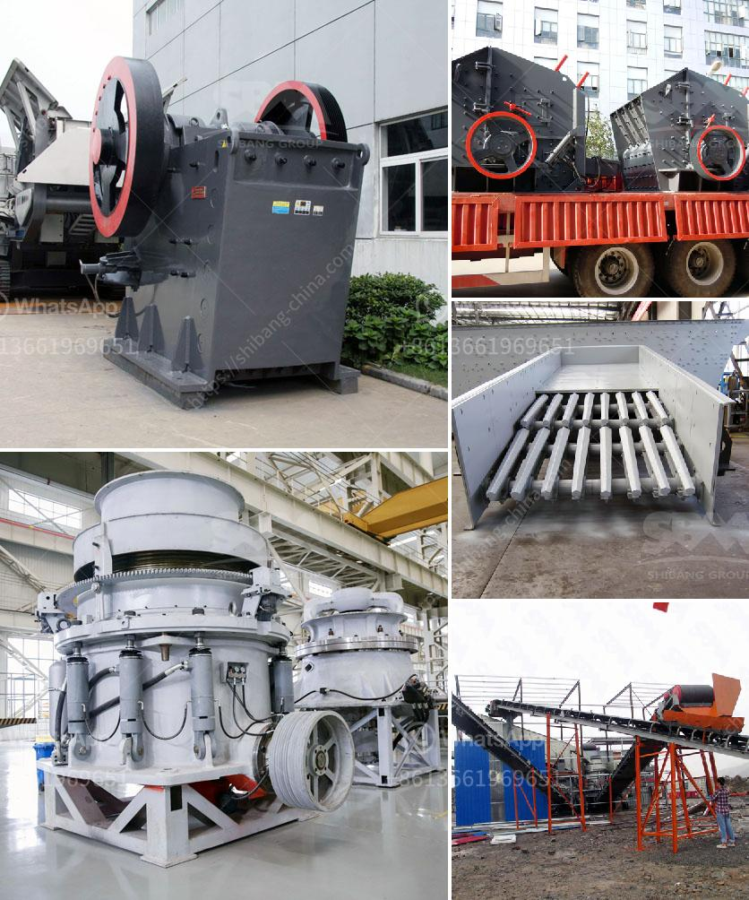

<h3>gypsum powder making</h3>
Gypsum powder is a versatile material that is used in various industries for different applications. It is a soft mineral that is composed of calcium sulfate dihydrate, and its chemical formula is CaSO4·2H2O. This powder is produced by finely grinding gypsum rock, which is then heated to remove any moisture and impurities. The resulting product is a white, smooth powder that is commonly known as gypsum powder.

One of the main uses of gypsum powder is in the construction industry. It is added to cement to enhance its properties, such as increasing its workability and reducing its setting time. Gypsum powder also acts as a filler material, helping to improve the overall strength and durability of concrete structures. It is widely used in the production of drywall, plasterboard, joint compounds, and other construction materials.

In addition to its application in construction, gypsum powder is also used in agriculture. It is a valuable soil amendment that helps to improve soil structure and enhances its water-holding capacity. By adding gypsum powder to the soil, farmers can prevent soil erosion, promote root development, and increase crop productivity. Moreover, gypsum powder is also used as a coagulant in tofu production, as a food additive, and in the manufacturing of pottery.

The process of making gypsum powder involves several steps. First, the raw gypsum rock is mined from the earth and transported to a crushing plant. Then, the crushed rock is ground into a fine powder using grinding mills. The ground gypsum is then heated in special kilns to remove any remaining moisture. Finally, the calcined gypsum is cooled and further processed to obtain the desired fineness of the powder.

In conclusion, gypsum powder production plays a crucial role in various industries, from construction to agriculture and food processing. Its unique properties make it a versatile material that is widely used for multiple purposes. With its wide range of applications and ease of production, gypsum powder continues to be in high demand, contributing to the growth and development of various sectors.
<h3>Contact us</h3><ul><li><strong>Whatsapp:&nbsp;<a href="https://wa.me/8613661969651">+8613661969651</a></strong></li><li><a href="https://swt.shibang-china.com/?git&amp;zhl&amp;gypsum powder making"><strong>Online Service(chat now)</strong></a></li></ul><h3>Related</h3><ul><li><a href='how to setting up of stone crusher unit.md'>how to setting up of stone crusher unit</a></li><li><a href='marble processing machine.md'>marble processing machine</a></li><li><a href='raymond mill manufactrer in udaipur.md'>raymond mill manufactrer in udaipur</a></li><li><a href='coconut shell powder making machine grinding mill for sale.md'>coconut shell powder making machine grinding mill for sale</a></li><li><a href='harga stone crusher plant merk.md'>harga stone crusher plant merk</a></li></ul>