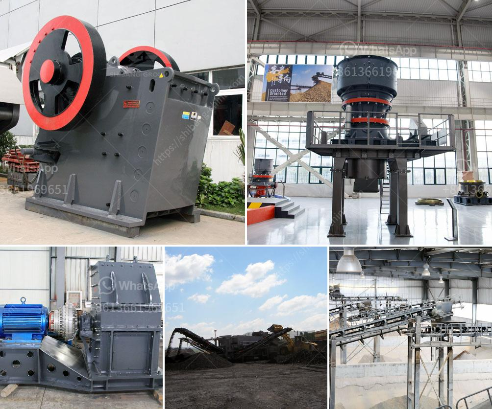

<h3>gypsum powder plant india</h3>
Gypsum powder is a versatile material widely used in various industrial applications. It is a key component in the production of cement, plaster of Paris, gypsum board, and other building materials. The demand for gypsum powder is growing rapidly, especially in India, where the construction industry is booming.

India, with its vast reserves of natural gypsum, is the world's second-largest gypsum producer after China. The country produces over 90% of its gypsum requirements domestically, making it self-sufficient in this crucial raw material. This self-sufficiency reduces the country's reliance on imports, making gypsum powder plants in India highly important.

Gypsum powder plants in India play a significant role in meeting the growing demand for gypsum-based products, primarily driven by the construction industry. Gypsum powder, also known as calcium sulfate dihydrate, is a mineral widely used for various purposes. It serves as a binder in cement manufacturing, acts as a retarder in the setting of concrete, provides strength to materials like wood, creates smooth finishes in wall plaster, and enhances the fire resistance of building products.

The process of manufacturing gypsum powder involves heating gypsum rock to a high temperature, where it loses its water content and transforms into a fine powder. Gypsum powder plants in India typically use rotary kilns to carry out this process. The heated gypsum is then crushed, cooled, and ground into a fine powder, which is bagged and ready for use.

There are several advantages to establishing gypsum powder plants in India. Firstly, the country has abundant reserves of natural gypsum, ensuring a steady supply at competitive prices. This reduces the cost of production, making Indian gypsum powder more affordable compared to imported alternatives.

Secondly, gypsum powder plants in India help promote local employment opportunities. These plants require skilled laborers, engineers, and technicians for their operation, creating jobs and boosting the local economy.

Furthermore, establishing gypsum powder plants in India contributes to the country's sustainable development goals. Gypsum powder is an eco-friendly material that reduces the carbon footprint of various industries. Its use in construction helps improve energy efficiency, reduces greenhouse gas emissions, and minimizes waste generation. By producing gypsum powder domestically, India can support its sustainable development agenda while minimizing the environmental impact.

In conclusion, gypsum powder plants in India are vital for the growth of the construction industry. The country's self-sufficiency in gypsum production, coupled with its abundant reserves, makes it an ideal location for establishing such plants. These plants not only meet the growing demand for gypsum-based products but also contribute to employment generation and sustainable development goals. As India continues to invest in infrastructure development and urbanization, the demand for gypsum powder will only increase, making the establishment of more gypsum powder plants a crucial step for the country's progress.
<h3>Contact us</h3><ul><li><strong>Whatsapp:&nbsp;<a href="https://wa.me/8613661969651">+8613661969651</a></strong></li><li><a href="https://swt.shibang-china.com/?git&amp;zhl&amp;gypsum powder plant india"><strong>Online Service(chat now)</strong></a></li></ul><h3>Related</h3><ul><li><a href='coal crusher machine in zhengzhou henan china.md'>coal crusher machine in zhengzhou henan china</a></li><li><a href='feldspar ball mill porcess.md'>feldspar ball mill porcess</a></li><li><a href='stone crushing plants in kenya.md'>stone crushing plants in kenya</a></li><li><a href='dry mix mortar plant from turkey.md'>dry mix mortar plant from turkey</a></li><li><a href='gold separator table for africa.md'>gold separator table for africa</a></li></ul>