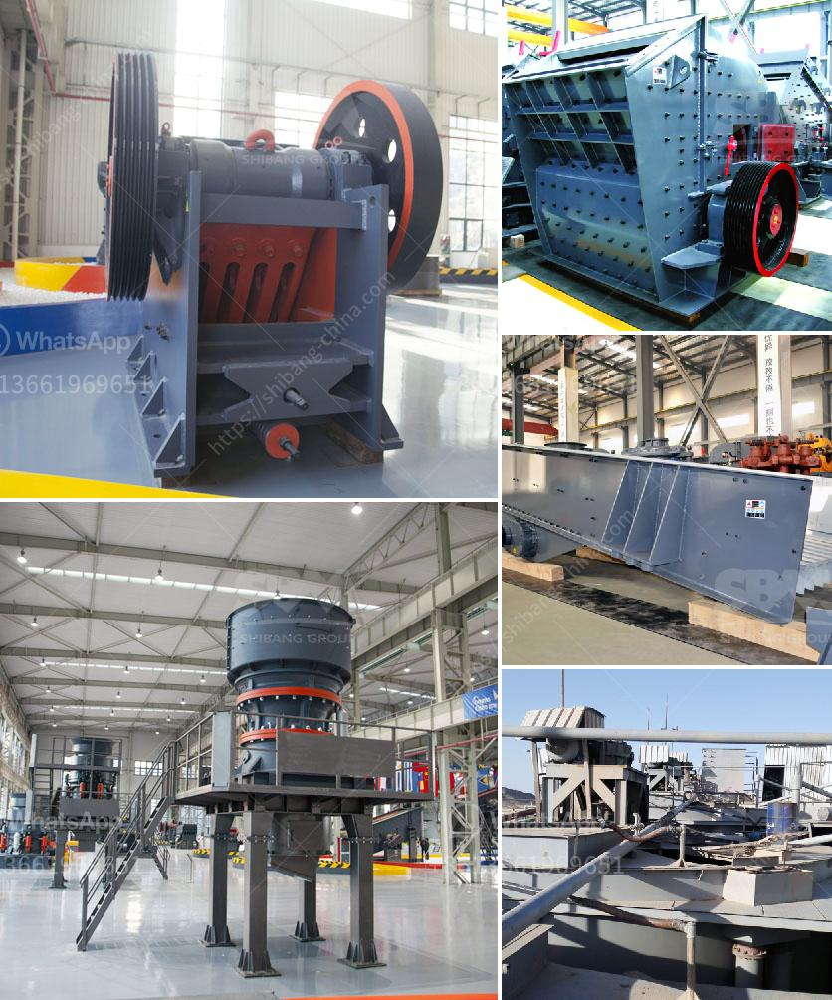

<h3>gypsum processing machine suppliers</h3>
Gypsum is a widely used industrial material and building material. Gypsum (CaSO4·2H2O) can be processed into a variety of products, such as a portland cement additive, soil conditioner, industrial and building plasters, and gypsum wallboard. Gypsum production process

Gypsum ore, from quarries and underground mines, is crushed and stockpiled near a plant. As needed, the stockpiled ore is further crushed and screened to about 50 millimeters (2 inches) in diameter. If the moisture content of the mined ore is greater than about 0.5 weight percent, the ore must be dried in a rotary dryer or a heated roller mill. Ore dried in a rotary dryer is conveyed to a roller mill, where it is ground to the extent that 90 percent or more of it is less than 100 micrometers (µm) (150 mesh). The ground gypsum powder is calcined in rotary kilns, or ring roll mills, to form a semihydrated mixture of calcium sulfate and water (Plaster of Paris).

Gypsum powder production is highly energy-consuming process. Grinding, for example, consumes about 4-5% of the total energy required to produce gypsum board products. As the biggest consumers of electricity, grinding mills are also the biggest polluters. Gypsum powder production line

Gypsum powder production line mainly consists of gypsum crushing machine, gypsum powder grinding mill, bucket elevator, electromagnetic vibrating feeder, etc. The finished products meet the market requirements, and are equipped with dust collectors in the operation, which are environmentally friendly and pollution-free, and are very suitable for users who have strict environmental requirements.

With the development of technology and economy, gypsum has wide application in more industries. The gypsum powder processing machines can be categorized into gypsum crushers, gypsum grinding mills, gypsum calcining equipment, gypsum powder production line, etc. Here are some popular gypsum crushing machines.

Jaw crusher is the most popular primary crusher that has the widest range of applications. It is easy to maintain and can be used for primary crushing to process large size raw materials with the maximum size of 1,000 mm.

Impact crusher is usually used as a secondary crusher in the production line, it can crush many kinds of materials with max feed size less than 500mm and crushing strength less than 360 MP. It is widely used for gypsum processing with a continuous working performance.

Cone crusher equipment is the preferred gypsum processing equipment on the market. In recent years, it has been applied to the treatment of non-metallic ore such as limestone, calcite, talc and wollastonite, as well as quartz, feldspar, clay, bentonite, and other ore materials. It has wide applications in the field of mining industry.

Grinding gypsum powder, we can choose Raymond mill equipment, and Guilin Hongcheng gypsum Raymond mill owns many advantages such as operation efficiency, reliable performance, cost-effective, is the gypsum powder enterprise trusted mill equipment. HLM Vertical Mill is able to turn waste into treasure and enhance the market value of gypsum powder.

Gypsum processing machine suppliers have contributed to the development of the gypsum mining and processing industry. The crusher, grinding mill, and other associated equipment are widely used in gypsum mining and processing operations. The equipment commonly used in gypsum crushing includes jaw crusher, cone crusher, impact crusher, roll crusher, hammer crusher, and so on. These gypsum processing machines are in high demands in the market as the prices of gypsum are pretty high. Therefore, it is wise to choose a suitable and reliable gypsum processing machine supplier to improve business efficiency and ensure the quality of finished products.
<h3>Contact us</h3><ul><li><strong>Whatsapp:&nbsp;<a href="https://wa.me/8613661969651">+8613661969651</a></strong></li><li><a href="https://swt.shibang-china.com/?git&amp;zhl&amp;gypsum processing machine suppliers"><strong>Online Service(chat now)</strong></a></li></ul><h3>Related</h3><ul><li><a href='crushed gravel supplier in negros oriental.md'>crushed gravel supplier in negros oriental</a></li><li><a href='prices for ball mill in south africa.md'>prices for ball mill in south africa</a></li><li><a href='mining conveyor prices.md'>mining conveyor prices</a></li><li><a href='conveyor belts bogota.md'>conveyor belts bogota</a></li><li><a href='ultra fine mill price.md'>ultra fine mill price</a></li></ul>