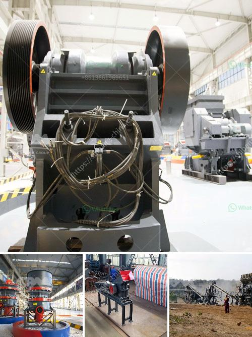

<h3>gypsum production line flow chart</h3>
Gypsum is a mineral with a wide variety of uses. It is frequently used in construction as a raw material for creating drywall, cement, and plaster of Paris. Gypsum is also commonly used in agriculture as a soil additive and fertilizer. This versatile mineral is processed through a gypsum production line, providing the necessary materials for these various industries.

The gypsum production line flow chart consists of crushing, grinding, calcination, storage, and conveyor systems. First, the gypsum raw material is crushed by jaw crusher and transported to the storage bin. Then the material is delivered to the mill for grinding. The ground gypsum is classified by a classifier and the powder meeting the fineness requirement is collected by the dust collector.

The next step in the gypsum production line is the calcination process. During calcination, the gypsum is heated to remove the water content and convert it into calcium sulfate hemihydrate (CaSO4·0.5H2O), commonly known as plaster of Paris. This process takes place in a calciner, a specialized equipment that can reach high temperatures. The calcined gypsum is then stored in silos for further processing.

After the calcination process, the gypsum can be used in various applications. In the construction industry, plaster of Paris can be mixed with water to create a paste that is spread over the surface to create a smooth and even finish. Gypsum powder can also be used as a core material in the production of gypsum board, commonly known as drywall. Additionally, gypsum can be further processed into gypsum blocks or gypsum bricks, which are widely used in construction.

In agriculture, gypsum is used as a soil amendment and fertilizer. It helps improve soil structure, reduce soil erosion, and increase nutrient uptake by plants. Gypsum is particularly beneficial for soils that are high in sodium or alkaline, as it helps to neutralize these conditions and create a more favorable environment for plant growth.

In conclusion, the gypsum production line flow chart illustrates the various steps involved in the production of gypsum, starting from its raw material extraction to its final application. Gypsum has a wide range of uses in construction and agriculture, making it an important mineral for these industries. The production line ensures that the gypsum is processed efficiently and effectively, meeting the quality standards required for its intended applications.
<h3>Contact us</h3><ul><li><strong>Whatsapp:&nbsp;<a href="https://wa.me/8613661969651">+8613661969651</a></strong></li><li><a href="https://swt.shibang-china.com/?git&amp;zhl&amp;gypsum production line flow chart"><strong>Online Service(chat now)</strong></a></li></ul><h3>Related</h3><ul><li><a href='ball mill machine.md'>ball mill machine</a></li><li><a href='coal beneficiation.md'>coal beneficiation</a></li><li><a href='gypsum production line.md'>gypsum production line</a></li><li><a href='lime grinding machine manufacturer in kolhapur.md'>lime grinding machine manufacturer in kolhapur</a></li><li><a href='stone crusher made in malaysia.md'>stone crusher made in malaysia</a></li></ul>