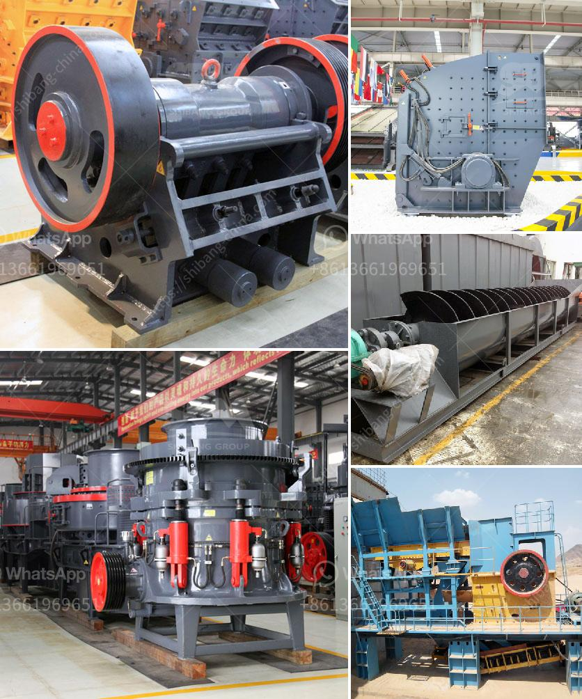

<h3>gypsum production line</h3>
Gypsum is a widely used material in construction projects, especially for making plaster and drywall. It is a naturally occurring mineral that consists of calcium sulfate dehydrate (CaSO4·2H2O) with various impurities. Gypsum has been used for centuries due to its excellent fire resistance, sound insulation properties, and versatility in construction applications.

To meet the growing demand for gypsum products, manufacturers have developed advanced production lines that ensure efficient and high-quality gypsum production. These production lines consist of various equipment and machinery that work together to process raw gypsum into finished products.

The first step in the gypsum production line is the extraction of gypsum ore from the mine. The extracted ore is transported to the crushing plant, where it is crushed into smaller particles for further processing. The crushed gypsum is then conveyed to the grinding mill, where it is ground into a powder of specified fineness.

Next, the powdered gypsum is fed into a calcination kiln, where it is heated at high temperatures to remove the water of crystallization and convert it into calcium sulfate hemihydrate (CaSO4·1/2H2O) or plaster of Paris. This process is known as calcination and is a critical step in gypsum production.

After calcination, the plaster of Paris is further processed to make various gypsum products. One common product is gypsum board, also known as drywall or plasterboard. In the gypsum board production line, the plaster of Paris is mixed with other additives like water, fiber reinforcement, and starch to form a slurry. This slurry is then poured onto a moving belt, where it is covered with a facing material and passed through a series of rollers to ensure uniform thickness.

Once the gypsum board is formed, it is cut into desired sizes, dried, and then packaged for transportation and storage. Gypsum board is widely used in interior walls, ceilings, and partitions due to its high strength, fire resistance, and ease of installation.

Apart from gypsum board, the gypsum production line can also produce other gypsum products like gypsum blocks, cornices, or tiles. These products are made by pouring the plaster of Paris into molds of specific shapes and sizes, which are then dried and finished to achieve the desired appearance.

In conclusion, the gypsum production line plays a crucial role in meeting the demand for gypsum products in the construction industry. With advanced technology and efficient processing equipment, manufacturers can produce high-quality gypsum products that meet the required standards. Gypsum board, gypsum blocks, and other gypsum products offer excellent fire resistance, sound insulation, and versatility in construction applications, making them a preferred choice for builders and contractors worldwide. The continuous improvement and development of gypsum production lines ensure a steady supply of this essential material for various construction projects.
<h3>Contact us</h3><ul><li><strong>Whatsapp:&nbsp;<a href="https://wa.me/8613661969651">+8613661969651</a></strong></li><li><a href="https://swt.shibang-china.com/?git&amp;zhl&amp;gypsum production line"><strong>Online Service(chat now)</strong></a></li></ul><h3>Related</h3><ul><li><a href='coal crusher machine in zhengzhou henan china.md'>coal crusher machine in zhengzhou henan china</a></li><li><a href='double rollar mill.md'>double rollar mill</a></li><li><a href='sand screen with vibrator.md'>sand screen with vibrator</a></li><li><a href='silica sand washing steps.md'>silica sand washing steps</a></li><li><a href='jual beli stone crusher bekas.md'>jual beli stone crusher bekas</a></li></ul>