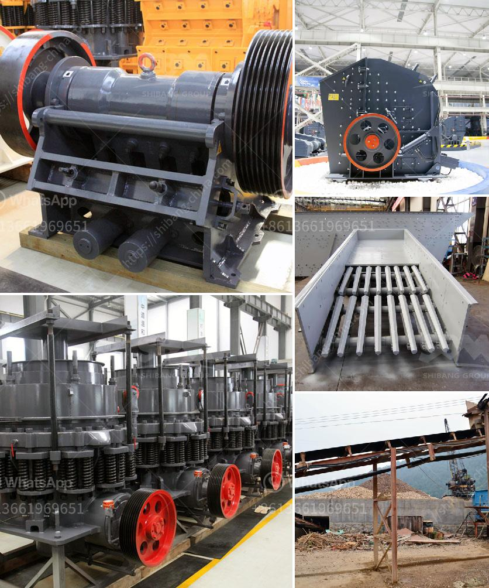

<h3>hammer crusher clinker</h3>
Clinker, a hard, nodular material produced by sintering limestone and clay, is the primary ingredient in cement production. As clinker particles are made finer by crushing, they enhance the reactivity of cement, thereby revolutionizing the cement industry. Hammer crushers have been effectively used in the cement industry for a long time, making them a popular choice for clinker processing.

Hammer crushers utilize impact rather than pressure to crush material. The material is fed into the hammer mill through a feed chute, and it encounters a series of rotating hammers that impact the material at high velocity. The hammers strike the material repeatedly, causing it to break down into smaller pieces. The crushed material is then discharged through a grate at the bottom, ensuring the desired product size.

One of the major advantages of using a hammer crusher for clinker crushing is its ability to produce a consistent and uniform clinker size. This is crucial for subsequent grinding operations, as a uniform size ensures optimal cement production. Additionally, the hammer crusher's high rotor speed and robust design make it possible to crush even the toughest clinker, ensuring high productivity and reliable performance.

Moreover, hammer crushers are highly versatile and can handle a wide range of materials. Besides clinker, they can also be used to crush other mineral materials such as limestone, gypsum, and coal. This makes them a valuable asset in various industries, including mining, construction, and chemical manufacturing.

Another significant advantage of hammer crushers is their simplicity and ease of operation. They have a straightforward design, with fewer components compared to other crushing machines, making maintenance and troubleshooting relatively easy. Additionally, their simple structure reduces the chances of mechanical failures, leading to less downtime and improved operational efficiency.

Safety is a crucial aspect of any industrial operation, and hammer crushers are no exception. Modern hammer crushers are equipped with advanced safety features to protect operators and minimize the risk of accidents. These safety measures include features such as easy access to wearing parts, emergency stop buttons, and overload protection. Such safety systems ensure that the machine can be operated safely and that any potential risks can be quickly addressed.

Overall, hammer crushers have proven to be a practical and reliable solution for clinker crushing. Their ability to produce a uniform clinker size, versatility in handling various materials, and ease of operation make them a preferred choice in the cement and other related industries. Additionally, their safety features provide peace of mind to operators and contribute to safe operating environments.

As the cement industry continues to evolve, hammer crushers for clinker crushing will remain an essential equipment in cement plants. They offer efficient and cost-effective solutions for the processing of clinker and contribute to the production of high-quality cement.
<h3>Contact us</h3><ul><li><strong>Whatsapp:&nbsp;<a href="https://wa.me/8613661969651">+8613661969651</a></strong></li><li><a href="https://swt.shibang-china.com/?git&amp;zhl&amp;hammer crusher clinker"><strong>Online Service(chat now)</strong></a></li></ul><h3>Related</h3><ul><li><a href='portable hard rock mining.md'>portable hard rock mining</a></li><li><a href='used stone crushers for sale from uae.md'>used stone crushers for sale from uae</a></li><li><a href='harga mobile crusher in indonesia.md'>harga mobile crusher in indonesia</a></li><li><a href='stone crusher pe 250x400.md'>stone crusher pe 250x400</a></li><li><a href='4 inch marble grinder mill.md'>4 inch marble grinder mill</a></li></ul>