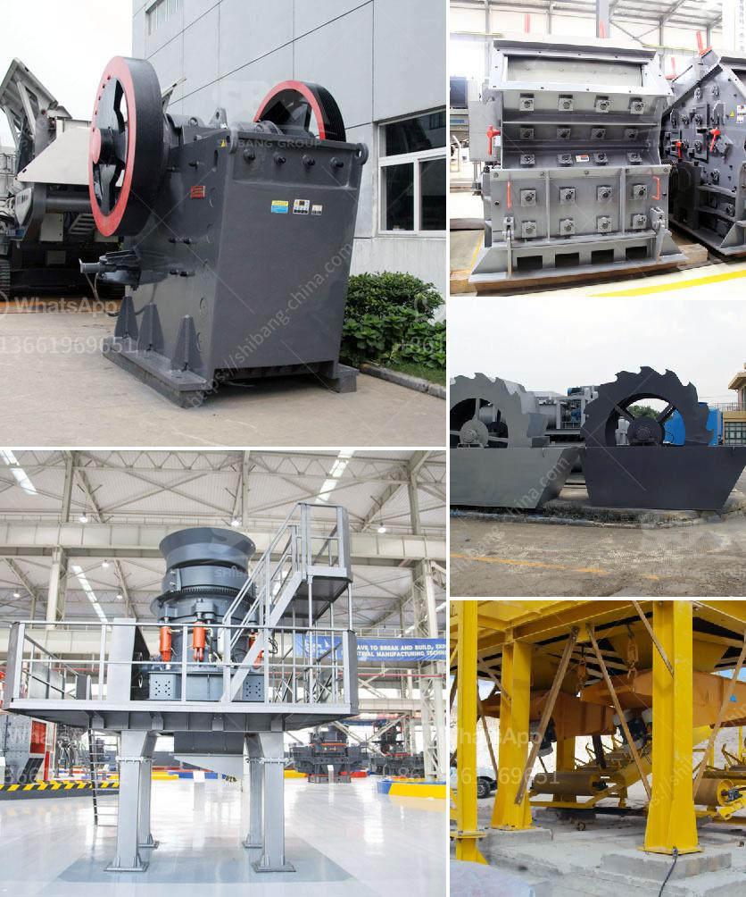

<h3>hammer crusher in china</h3>
Hammer crusher is a machine that is used to crush various materials into small pieces. The main working principle is using high speed rotating hammers to crush materials, which can make the two big materials collide with each other and smash into smaller granules. The hammer crusher is widely used in industries such as cement, electricity, chemical engineering, building materials and other industries, which can complete the medium and fine crushing operations of limestone, slag, coke, coal and other materials.

Its main features are simple structure, high production capacity, low energy consumption and easy maintenance. The hammer crusher is suitable for both dry and wet crushing of brittle, medium-hard materials for the mining, cement, coal, metallurgic, construction material, road building, and petroleum & chemical industries. Since the hammer crusher machine has many features like small size and easy installation, it is very suitable for constant wear and tear operations.

In recent years, China's gold mining industry has received increased foreign and domestic investment, and project numbers have increased as more discoveries have been found. China produced nearly 300 tonnes of gold in 2008. It is also the only country in the top three where production rose in 2008. The production increase was primarily attributable to new projects in the Northern Territory and increased production at the Sunrise Dam and Tanami mines.

In addition to gold, China is also a major producer of coal, lead, zinc and rare earth minerals. China accounted for 51% of global coal production in 2019 and accounted for 82% of global rare earth mineral production. These figures highlight the significance of the mining industry in China.

As the world's largest producer of crushing, grinding and screening equipment, China's crusher in the same technology and equipment level in the world are not perfect, the domestic market position is also very impressive. In 2016, China's first high-speed railway construction, sand and gravel aggregate crushing equipment successfully put into use. The hammer crusher quickly won the domestic market and a large number of orders, which opened the market demand for the online aggregate industry.

Besides, during the process of machine production, a large amount of carbon dioxide will release which will have a direct impact on the surrounding environment. As the largest producer of hammer crushers in China, the research and production of SBM crushers effectively protect the environment. With the upgrading of technology, crushers with intelligent functions and environmental protection technologies have been launched, which have attracted a lot of attention and support from customers at home and abroad, and have provided a solid foundation for the development of the industry.

In conclusion, the hammer crusher produced by China SBM heavy industry not only overcomes the crushing ratio and environmental protection problems in the real production process, but also achieves a mechanical equipment with advanced technology and structure. SBM heavy hammer crusher is suitable for crushing limestone and other medium hardness and brittle materials with compression strength not exceeding 150 MPa and humidity lower than 15%. The equipment is widely used in cement, mining, coal preparation, power generation, ceramics, and other industries. This not only improves the market competitiveness of SBM heavy industry, but also helps customers achieve better economic benefits.
<h3>Contact us</h3><ul><li><strong>Whatsapp:&nbsp;<a href="https://wa.me/8613661969651">+8613661969651</a></strong></li><li><a href="https://swt.shibang-china.com/?git&amp;zhl&amp;hammer crusher in china"><strong>Online Service(chat now)</strong></a></li></ul><h3>Related</h3><ul><li><a href='nigeria inpactor crushers price.md'>nigeria inpactor crushers price</a></li><li><a href='crusher 50 ton per hour price.md'>crusher 50 ton per hour price</a></li><li><a href='cost of belt conveyor coal transport.md'>cost of belt conveyor coal transport</a></li><li><a href='calculate output of aggregate crushing plant.md'>calculate output of aggregate crushing plant</a></li><li><a href='how much is ballast crusher machine in kenya.md'>how much is ballast crusher machine in kenya</a></li></ul>