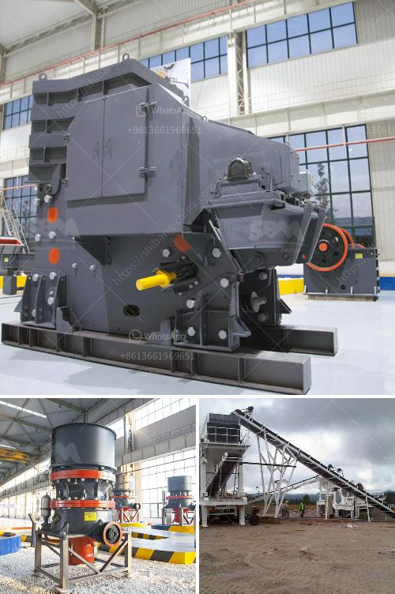

<h3>hammer grinder mill</h3>
The hammer grinder mill is an essential piece of equipment that is used to shred and crush materials into smaller particles. It has a high capacity and efficiency to ensure that materials are properly ground and processed. This tool is commonly used in industries such as agriculture, mining, and construction, where large quantities of material need to be processed efficiently.

One of the key features of a hammer grinder mill is its ability to grind and crush a wide range of materials. Whether it is grain, corn, wood chips, or even plastic, this machine can handle it all. The hammer grinder mill uses a series of high-speed rotating hammers to impact, shatter, and reduce the material into smaller particles. This process is ideal for grinding coarse and fibrous materials that cannot be easily processed using other methods.

The construction of the hammer grinder mill is typically robust and durable, as it needs to withstand high impact and abrasion during operation. The machine consists of a rotor assembly with multiple hammers attached to it. These hammers are equipped with sharp edges that deliver a powerful blow to the material, effectively breaking it down into smaller pieces. The material is then discharged through a screen located at the bottom of the mill to achieve the desired particle size.

One of the advantages of using a hammer grinder mill is its high capacity and efficiency. Its design allows for continuous operation, enabling large quantities of material to be processed quickly. This is especially beneficial in industries that require high production rates. Additionally, the hammer grinder mill can be easily adjusted to produce different particle sizes, making it a versatile tool for various applications.

Another advantage of the hammer grinder mill is its ability to reduce waste. By grinding and processing materials, it allows for the utilization of resources that would otherwise go to waste. For example, in the agriculture industry, the hammer grinder mill is used to process corn stalks, wheat straw, and other agricultural waste into animal feed. This not only reduces waste but also provides a cost-effective solution for farmers.

Furthermore, the hammer grinder mill is relatively easy to operate and maintain. It does not require complex setup or extensive training to operate. Regular maintenance, such as checking and replacing worn-out hammers or screens, ensures the machine's optimal performance and longevity.

In conclusion, the hammer grinder mill is a versatile and efficient tool for grinding and crushing materials into smaller particles. Its high capacity, durability, and ability to process a wide range of materials make it a valuable asset in various industries. Whether used for grinding grain, processing agricultural waste, or reducing construction materials, the hammer grinder mill offers a reliable and cost-effective solution for material processing needs.
<h3>Contact us</h3><ul><li><strong>Whatsapp:&nbsp;<a href="https://wa.me/8613661969651">+8613661969651</a></strong></li><li><a href="https://swt.shibang-china.com/?git&amp;zhl&amp;hammer grinder mill"><strong>Online Service(chat now)</strong></a></li></ul><h3>Related</h3><ul><li><a href='ball mill manufacturers coconut shell.md'>ball mill manufacturers coconut shell</a></li><li><a href='ball mill machinery supplier manufacturer.md'>ball mill machinery supplier manufacturer</a></li><li><a href='grinding raymond mill.md'>grinding raymond mill</a></li><li><a href='buy jaw crusher machine.md'>buy jaw crusher machine</a></li><li><a href='petimex impact crushers manial petite.md'>petimex impact crushers manial petite</a></li></ul>