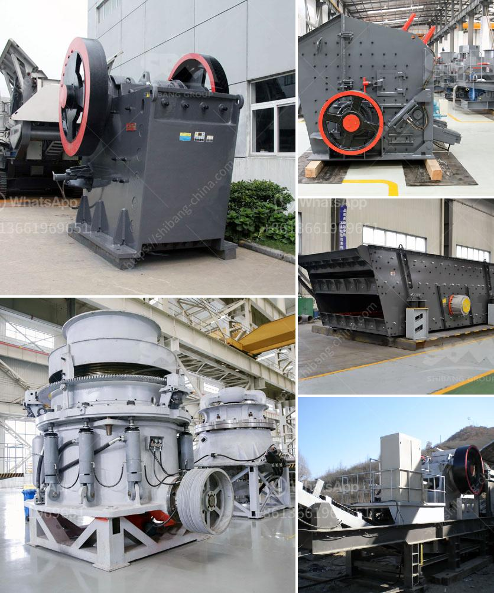

<h3>hammer mill 50 hr</h3>
The hammer mill 50 hr is a state-of-the-art technology in grinding and crushing materials. It is widely used in metallurgy, mining, chemical, cement, coal gangue, construction, sand, refractory material, ceramic and other industries. With its unique design and efficiency, this machine can process various materials, such as limestone, coal, salt, gypsum, alum, brick and tile, etc.

One of the key features of the hammer mill 50 hr is its high working efficiency, reaching up to 50 tons per hour. The rotating hammers inside the machine, combined with the adjustable screen, ensure a consistent and uniform particle size output. This not only improves the grinding and crushing efficiency but also saves energy consumption.

In addition to its high efficiency, the hammer mill 50 hr is also known for its durability and low maintenance requirement. The machine is built with high-quality materials and components, ensuring a long service life even under heavy use. Its easy-to-maintain design allows for quick replacement of worn-out parts, reducing downtime and increasing production efficiency.

Furthermore, the hammer mill 50 hr offers flexibility in its operation. It can be used as a primary, secondary, or tertiary crusher, depending on the specific needs of the application. The adjustable screen size allows for the production of different particle sizes, making it suitable for a variety of industries and materials.

When it comes to safety, the hammer mill 50 hr is equipped with multiple safety features. The machine is designed with a protective cover to prevent accidents and injuries during operation. It also has an automatic shut-off system in case of any malfunction, ensuring the safety of the operators and preventing equipment damage.

Overall, the hammer mill 50 hr is an efficient, durable, and versatile machine that is revolutionizing the grinding and crushing industry. Its high capacity, low maintenance requirement, and safety features make it an ideal choice for various applications. Whether it is used in a cement plant, mining site, or construction project, the hammer mill 50 hr delivers outstanding performance and reliability.
<h3>Contact us</h3><ul><li><strong>Whatsapp:&nbsp;<a href="https://wa.me/8613661969651">+8613661969651</a></strong></li><li><a href="https://swt.shibang-china.com/?git&amp;zhl&amp;hammer mill 50 hr"><strong>Online Service(chat now)</strong></a></li></ul><h3>Related</h3><ul><li><a href='jaw crusher manganese.md'>jaw crusher manganese</a></li><li><a href='ball mills south africa.md'>ball mills south africa</a></li><li><a href='limestone process plant.md'>limestone process plant</a></li><li><a href='manufacturing process of plaster of paris china.md'>manufacturing process of plaster of paris china</a></li><li><a href='iron ore crusher in pakistan.md'>iron ore crusher in pakistan</a></li></ul>