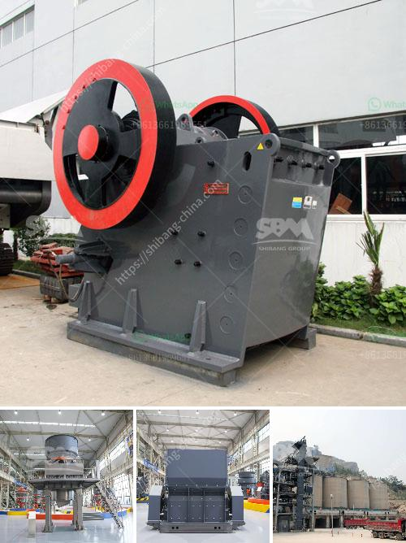

<h3>hammer mill clay</h3>
Clay is an abundant natural resource that has been used for centuries in a variety of industries. From pottery and ceramics to brick making and agriculture, clay plays a vital role in many aspects of our daily lives. One method of processing clay that has gained popularity in recent years is the use of hammer mills.

A hammer mill is a machine designed to crush and shred different materials into smaller pieces. In the case of clay, this could efficiently break down large chunks or lumps of clay into smaller, more manageable particles for smoother mixing and processing. The primary function of a hammer mill is to fragmentize the material into uniform sizes suitable for further processing or usage.

So, how does a hammer mill work? A hammer mill consists of a rotating shaft with hammers affixed to it. As the shaft spins, the attached hammers repeatedly impact the clay material, shredding it into smaller particles. These particles are then expelled through a screen or grate, which determines the final size of the material.

The use of a hammer mill in clay processing can have several benefits. Firstly, it improves the clay's workability, making it easier to handle and mold into various shapes. By reducing the clay's particle size, a hammer mill can improve plasticity and plastic deformation properties, making it more suitable for forming intricate designs.

Secondly, a hammer mill can help in the blending and homogenization of different clay types. Clay sourced from different locations can have varying properties, such as color, plasticity, and shrinkage. By processing the clay through a hammer mill, these differences can be minimized, ensuring a consistent and high-quality end product.

Furthermore, hammer milling clay can enhance clay drying processes. Smaller clay particles have a larger surface area, allowing for improved moisture evaporation. This can significantly reduce drying times, especially for larger clay batches, leading to increased production efficiency.

In addition to its benefits in clay processing, a hammer mill can be a versatile machine with applications in various industries. It can handle a wide range of materials apart from clay, such as grains, ores, and even biomass. This versatility makes it a valuable asset for industries that require material size reduction.

Although a hammer mill offers numerous advantages, it is essential to choose the right mill for the specific clay processing needs. Factors such as desired final particle size, capacity, and the type of clay being processed should be considered when selecting a hammer mill. Consulting an expert or a machine manufacturer can be beneficial in making an informed decision.

In conclusion, hammer mill clay processing provides a versatile and efficient solution for reducing the size of clay particles. This method improves clay workability, blending, and drying processes, resulting in high-quality end products for various applications. When choosing a hammer mill for clay processing, it is important to consider specific requirements to maximize its benefits. With the right equipment, hammer milling clay can pave the way for increased production and enhanced product performance in a range of industries.
<h3>Contact us</h3><ul><li><strong>Whatsapp:&nbsp;<a href="https://wa.me/8613661969651">+8613661969651</a></strong></li><li><a href="https://swt.shibang-china.com/?git&amp;zhl&amp;hammer mill clay"><strong>Online Service(chat now)</strong></a></li></ul><h3>Related</h3><ul><li><a href='calculate output of aggregate crushing plant.md'>calculate output of aggregate crushing plant</a></li><li><a href='price limestone rock crusher.md'>price limestone rock crusher</a></li><li><a href='crusher plant in peshawar.md'>crusher plant in peshawar</a></li><li><a href='conveyor belts in merida.md'>conveyor belts in merida</a></li><li><a href='impact crusher ld pfw.md'>impact crusher ld pfw</a></li></ul>