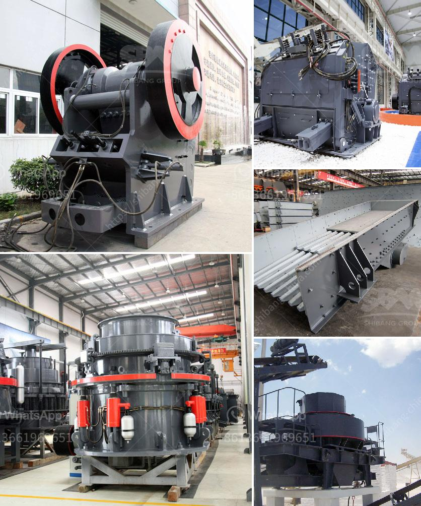

<h3>hammer mill components</h3>
Hammer mills are used in a wide range of industries, including mining, agriculture, and material recycling. They are essential components in many different types of equipment, such as grain processing plants, animal feed mills, and wood shredding machines. Understanding the components of these machines and how they work together is essential for maximizing their efficiency and prolonging their lifespan.

One of the primary components of a hammer mill is the rotor, which consists of a central shaft and several rotor discs mounted on it. The hammers are the main tools for impacting the material being processed. The shape, size, and number of hammers can affect the efficiency of the mill and the size of the final product. Hammers may be fixed to the rotor or hinged to allow for easy replacement or adjustment.

The housing or casing is another crucial component of a hammer mill. It encloses the rotor and provides support and protection for the internal components. The housing is typically made of heavy-duty steel to withstand the impact forces generated during the grinding process. It also incorporates screens or grates to control the size of the final product.

The grinding chamber is where the action happens in a hammer mill. This is the area where the hammers and the material being processed come into contact. The size of the grinding chamber can vary depending on the specific application of the mill. A larger grinding chamber allows for more efficient grinding and higher throughput.

Another essential component of a hammer mill is the feed mechanism. This is the part of the machine that controls the flow of material into the grinding chamber. The feed mechanism may consist of a hopper, a conveyor belt, or an auger, depending on the type and size of the mill. It is crucial to ensure a consistent and controlled feed rate to optimize the grinding process and prevent overloading the machine.

The motor is the power source that drives the rotor and provides energy for the grinding process. The size and power of the motor depend on the size and capacity of the mill. Many modern hammer mills are equipped with variable speed drives, allowing for better control over the grinding process and ensuring optimal performance.

Proper maintenance and regular inspection of all the components are essential for the efficient operation of a hammer mill. Worn out or damaged parts can affect the performance of the mill and increase the risk of breakdowns. It is recommended to follow the manufacturer's guidelines for maintenance and replacement of parts to ensure the longevity and reliability of the machine.

In conclusion, hammer mills are versatile machines used in a variety of industries for grinding and shredding materials. Understanding the various components and how they work together is crucial for optimizing their performance and prolonging their lifespan. Regular maintenance and inspection of these components are essential for ensuring the efficient operation of the mill and preventing costly breakdowns.
<h3>Contact us</h3><ul><li><strong>Whatsapp:&nbsp;<a href="https://wa.me/8613661969651">+8613661969651</a></strong></li><li><a href="https://swt.shibang-china.com/?git&amp;zhl&amp;hammer mill components"><strong>Online Service(chat now)</strong></a></li></ul><h3>Related</h3><ul><li><a href='crusher pirdra crusher puedra.md'>crusher pirdra crusher puedra</a></li><li><a href='ball mill 25 tons per hour price.md'>ball mill 25 tons per hour price</a></li><li><a href='list of crusher industry in nepal.md'>list of crusher industry in nepal</a></li><li><a href='jaw crusher in kenya.md'>jaw crusher in kenya</a></li><li><a href='used crushing machine price.md'>used crushing machine price</a></li></ul>