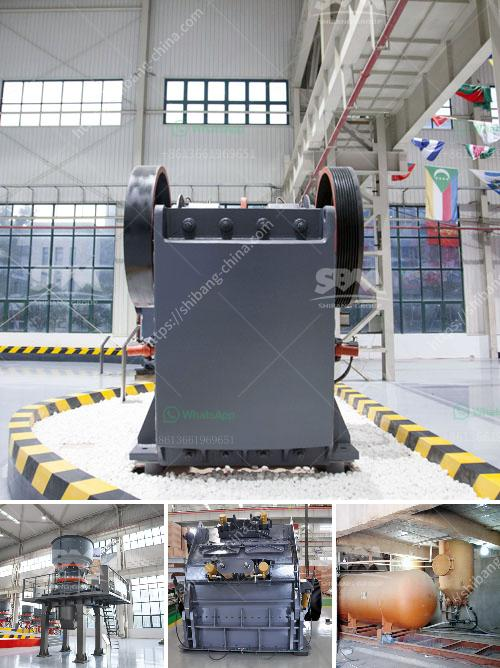

<h3>hammer mill crusher drawings</h3>
A hammer mill crusher is an essential industrial tool that reduces the size of particles. Different models of hammer mill crushers can accommodate different quantities and sizes of raw materials. The power source of the crusher is either electric or diesel engines, while the capacity varies from 500 to 3000 kg/hr. By reducing the size of raw materials, such as wood chips, corn, and grains, hammer mill crushers facilitate the creation of homogeneous and uniform products.

One crucial aspect of hammer mill crushers is the design, as it plays a significant role in the efficiency and effectiveness of the crushing process. A well-designed hammer mill crusher consists of a rotor assembly with a swing hammer, a crushing chamber, a grating or screen at the bottom, and an electric or diesel motor. The rotation speed of the rotor determines the size of materials processed, and the perforated screen or grating controls the final size of the particles. 

To ensure optimal performance and durability, it is essential to have accurate and detailed drawings of hammer mill crushers. These drawings are crucial during the manufacturing process, as they provide precise dimensions, specifications, and construction details. Manufacturers rely on these drawings to craft a reliable and efficient crusher that meets the specific requirements of clients.

Moreover, detailed drawings of hammer mill crushers provide crucial information for maintenance and repairs. In the event of a breakdown or component failure, these drawings serve as a reference to troubleshoot and replace damaged parts. They also assist in ensuring the correct assembly and alignment during repair work, further enhancing the crusher's performance and extending its lifespan.

In conclusion, hammer mill crusher drawings play a significant role in the manufacturing, maintenance, and repair processes of these industrial tools. Accurate and detailed drawings are essential for creating an efficient and durable crusher that meets the specific needs of various industries. By relying on these drawings, manufacturers can ensure consistency in their production, while maintenance and repair teams can troubleshoot and address issues with precision. With the help of accurate drawings, hammer mill crushers continue to be a vital component in reducing the size of particles in industries such as agriculture, mining, and construction.
<h3>Contact us</h3><ul><li><strong>Whatsapp:&nbsp;<a href="https://wa.me/8613661969651">+8613661969651</a></strong></li><li><a href="https://swt.shibang-china.com/?git&amp;zhl&amp;hammer mill crusher drawings"><strong>Online Service(chat now)</strong></a></li></ul><h3>Related</h3><ul><li><a href='dolomite mining and processing.md'>dolomite mining and processing</a></li><li><a href='raymond mill price.md'>raymond mill price</a></li><li><a href='stone crusher equipment supplier.md'>stone crusher equipment supplier</a></li><li><a href='mobile stone crusher plant on hire in india.md'>mobile stone crusher plant on hire in india</a></li><li><a href='hammer mill crusher drawings.md'>hammer mill crusher drawings</a></li></ul>