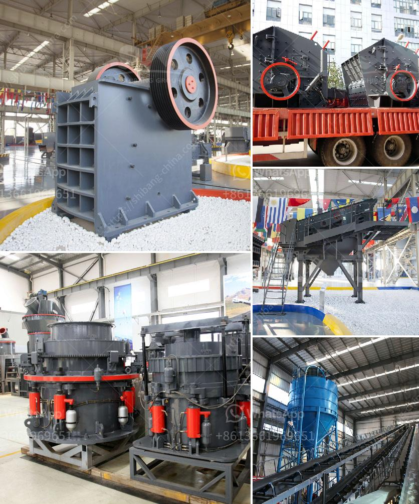

<h3>hammer mill for sale in dubai</h3>
The hammer mill is a necessary equipment in many industries, especially in the field of grinding and milling. It has versatile applications, which can cover a wide range of tasks such as reducing grain size, recycling waste materials, and even pulverizing metallic substances. In Dubai, there are many suppliers and manufacturers of this machine, which offer it for sale to individuals and businesses that require it for their operations.

Dubai is known for its vibrant industrial sector, which has been growing rapidly over the years. As the demand for various products continues to increase, so does the need for efficient and reliable machinery. The hammer mill is no exception. With its ability to process materials quickly and effectively, it has become an essential tool for many businesses in Dubai.

When it comes to purchasing a hammer mill in Dubai, there are several factors to consider. First and foremost, one needs to determine the specific requirements of their industry. Different industries may have different needs, such as the desired capacity, power source, or material handling capabilities. By understanding these needs, one can find a hammer mill that suits their specific needs.

Secondly, it is essential to research and choose a reputable supplier or manufacturer in Dubai. This ensures that the machine purchased is of high quality and will deliver excellent performance. Reading reviews and checking the track record of the supplier can provide valuable insights into their reliability and customer satisfaction.

Additionally, one should consider the after-sales service provided by the supplier. This includes factors such as warranty, technical support, and availability of spare parts. A reliable supplier will have a dedicated team to handle any concerns or issues that may arise with the hammer mill, ensuring minimal downtime and maximum productivity.

In conclusion, a hammer mill is an indispensable machine in many industries in Dubai. With its wide range of applications, it offers efficient and effective solutions for tasks related to grinding, milling, and pulverizing. By understanding the specific requirements of the industry and choosing a reputable supplier, one can find a hammer mill for sale in Dubai that meets their needs and delivers excellent performance.
<h3>Contact us</h3><ul><li><strong>Whatsapp:&nbsp;<a href="https://wa.me/8613661969651">+8613661969651</a></strong></li><li><a href="https://swt.shibang-china.com/?git&amp;zhl&amp;hammer mill for sale in dubai"><strong>Online Service(chat now)</strong></a></li></ul><h3>Related</h3><ul><li><a href='double rollar mill.md'>double rollar mill</a></li><li><a href='quarry dust in concrete sand making stone quarry.md'>quarry dust in concrete sand making stone quarry</a></li><li><a href='production of cement mill in algerie.md'>production of cement mill in algerie</a></li><li><a href='rubble crushers for sale.md'>rubble crushers for sale</a></li><li><a href='plant grinder mill price.md'>plant grinder mill price</a></li></ul>