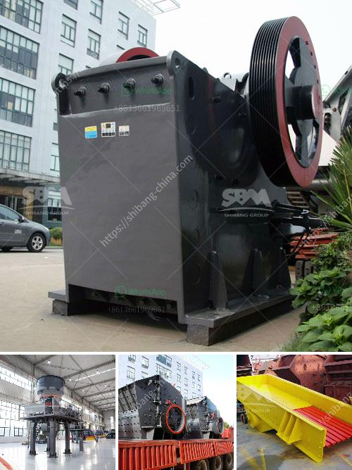

<h3>hammer mill grinder for sale in dubai</h3>
In recent years, the UAE has witnessed tremendous growth and investment in different sectors. The economy is booming, and infrastructure projects are underway. Dubai, in particular, is experiencing a rapid transformation with numerous construction projects, industrial ventures, and commercial establishments cropping up. With such developments, the demand for equipment and machinery has also seen a significant surge.

One such machinery that has gained immense popularity is the hammer mill grinder. This powerful and versatile machine is used for grinding or crushing different materials into smaller pieces. With the capability to perform both coarse and fine grinding, it is widely used in industries such as agriculture, mining, and construction. From grinding grains and corn to crushing rocks and stones, the hammer mill grinder has multiple applications, making it an essential tool for many businesses.

If you are in the market for a hammer mill grinder in Dubai, there are numerous options to choose from. However, it is crucial to select a reliable and reputable supplier that offers high-quality equipment. A trusted supplier will not only provide a wide range of options but also ensure that the machinery meets industry standards and is built to last.

When looking for a hammer mill grinder for sale in Dubai, there are several factors to consider. Firstly, the capacity and capability of the machine play a significant role in its performance. It is essential to choose a grinder that matches your specific requirements, whether you need it for small-scale operations or heavy-duty industrial processing.

Secondly, the durability and reliability of the grinder are crucial. You want a machine that can withstand heavy usage without frequent breakdowns or maintenance. A well-built and sturdy hammer mill grinder will save you time and money in the long run, as it will require minimal repairs or replacements.

Furthermore, the ease of operation and maintenance should also be taken into account. A good hammer mill grinder should be user-friendly, allowing operators to adjust settings easily and ensuring smooth operation. Additionally, it should be easy to clean and maintain, prolonging the lifespan of the machine and maintaining optimal performance.

Moreover, it is essential to consider the level of after-sales support provided by the supplier. A reputable supplier will offer technical assistance, spare parts, and servicing to ensure that your hammer mill grinder continues to perform at its best. This support is crucial, as it guarantees minimal downtime and maximum productivity for your business.

In conclusion, a hammer mill grinder is an efficient and versatile crushing solution that can cater to various industries' needs. If you are in Dubai and require this powerful machine, it is essential to choose a reliable supplier that offers high-quality equipment. Consider factors such as capacity, durability, ease of operation, and after-sales support when making your purchase. By investing in the right hammer mill grinder, you can enhance your business operations, save time and money, and contribute to the UAE's growing economy.
<h3>Contact us</h3><ul><li><strong>Whatsapp:&nbsp;<a href="https://wa.me/8613661969651">+8613661969651</a></strong></li><li><a href="https://swt.shibang-china.com/?git&amp;zhl&amp;hammer mill grinder for sale in dubai"><strong>Online Service(chat now)</strong></a></li></ul><h3>Related</h3><ul><li><a href='belt conveyor calculation sheet.md'>belt conveyor calculation sheet</a></li><li><a href='small rock gravel crushers.md'>small rock gravel crushers</a></li><li><a href='raymond mill price.md'>raymond mill price</a></li><li><a href='gold ore refinery portable machinery maker china.md'>gold ore refinery portable machinery maker china</a></li><li><a href='impact crusher for sale in bulawayo.md'>impact crusher for sale in bulawayo</a></li></ul>