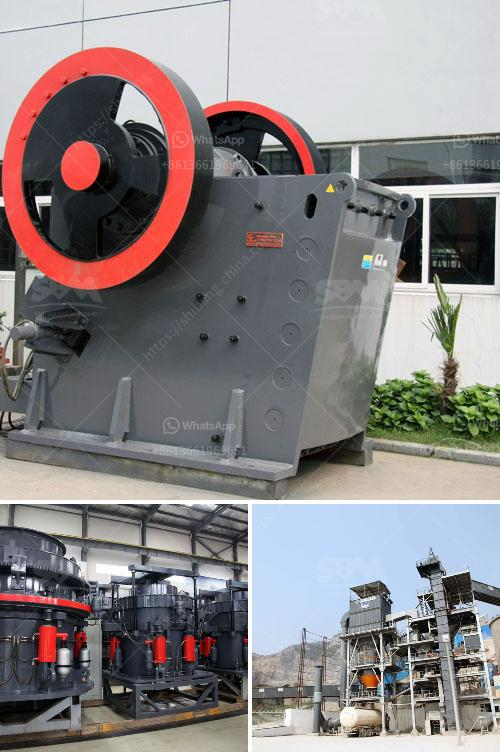

<h3>hammer mill h 300 tph</h3>
The hammer mill is a versatile machine that utilizes high-speed rotating hammers to crush, grind, and shred various materials. This mill is commonly used in the production of animal feeds, cannabis, ethanol, wood, and other materials requiring size reduction. With its robust construction and large-sized grinding chamber, the hammer mill H 300 tph is a reliable and powerful machine that can handle a wide range of applications.

One of the key features of the hammer mill H 300 tph is its high capacity. With a capacity of up to 300 tons per hour, this mill is suitable for large-scale operations that require quick and efficient grinding. The mill's large grinding chamber can accommodate bulky materials, reducing the need for pre-processing or size reduction before grinding.

Another important feature of the hammer mill H 300 tph is its adjustable grinding gap. This allows operators to control the particle size of the final product, ensuring consistency and uniformity. The adjustable grinding gap also enables the mill to handle different types of materials, from coarse grains to fine powders.

The hammer mill H 300 tph is designed for easy maintenance and cleaning. The mill's internal components can be accessed and replaced quickly, minimizing downtime and ensuring optimal performance. Additionally, the mill's screen can be easily changed to accommodate different particle sizes or materials, further enhancing its versatility.

Safety is a top priority when it comes to operating the hammer mill H 300 tph. The mill is equipped with safety features, such as an emergency stop button and safety guards, to protect operators from accidents or injuries. The mill also meets all relevant safety standards and regulations, ensuring peace of mind for operators and compliance with industry requirements.

In terms of efficiency, the hammer mill H 300 tph is equipped with a powerful motor that delivers high torque and ensures consistent grinding performance. The mill's energy-efficient design reduces energy consumption, making it an environmentally friendly option for grinding applications.

In conclusion, the hammer mill H 300 tph is a reliable and powerful machine that can handle a wide range of applications requiring size reduction. Its high capacity, adjustable grinding gap, easy maintenance, and safety features make it a versatile and efficient choice for large-scale operations. Whether you are in the animal feed, cannabis, ethanol, or wood industry, this hammer mill is a valuable addition to your production line.
<h3>Contact us</h3><ul><li><strong>Whatsapp:&nbsp;<a href="https://wa.me/8613661969651">+8613661969651</a></strong></li><li><a href="https://swt.shibang-china.com/?git&amp;zhl&amp;hammer mill h 300 tph"><strong>Online Service(chat now)</strong></a></li></ul><h3>Related</h3><ul><li><a href='raymond roller mill model 30 picture.md'>raymond roller mill model 30 picture</a></li><li><a href='small scale tin mining design.md'>small scale tin mining design</a></li><li><a href='chrome washing plant new technology.md'>chrome washing plant new technology</a></li><li><a href='operating a granite quarry crusher in nigeria.md'>operating a granite quarry crusher in nigeria</a></li><li><a href='designs of hammer mills.md'>designs of hammer mills</a></li></ul>