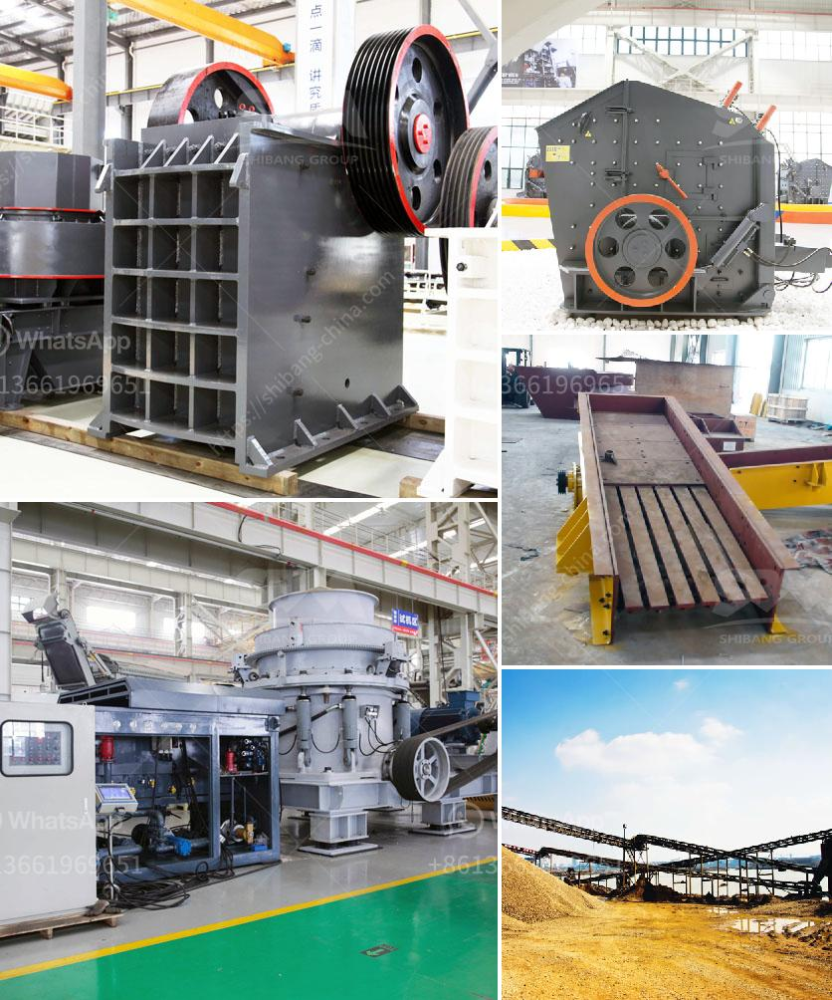

<h3>hammer mill how it works</h3>
The hammer mill is an essential piece of equipment in many industrial and agricultural processes. It is used to crush and grind different types of materials into smaller particles, such as grains, seeds, and powders. In the past, the hammer mill was widely used in various industries for crushing and grinding purposes. However, its use gradually declined with the advent of modern technologies and machines. Nevertheless, it is still a valuable tool in certain applications due to its simplicity and effectiveness.

The basic concept of a hammer mill involves a rotating shaft on which hammers are mounted. The hammers are free to swing on the ends of the cross, or fixed to the central rotor. The rotor is spun by a motor, causing the hammers to move radially outward and impact the material being processed. The smaller particles are then crushed or ground to a desired size.

One of the main advantages of a hammer mill is its versatility. While most mills are limited to specific materials and applications, the hammer mill can handle a wide range of materials and sizes. It can be used for anything from reducing the size of biomass, such as wood chips and straw, to grinding grain for ethanol production. Other applications include the grinding of spices, coffee beans, and animal feed.

The size and design of a hammer mill vary depending on the nature of the materials being processed. For example, particle size reduction is achieved through the use of a screen with holes ranging in size from 0.6mm to 8mm. The size of the screen is determined by the desired finished particle size, which in turn depends on the intended application. Some materials may require multiple passes through the hammer mill to achieve the desired outcome.

In addition to particle size reduction, a hammer mill can also be used to de-agglomerate materials, disrupt cell walls, and create emulsions. These additional functions are made possible by the high-speed impact of the hammers on the material being processed.

However, despite its many advantages, the use of a hammer mill has some limitations. One of the main concerns is the potential for damage to the mill if foreign objects, such as stones or metal pieces, enter the feed stream. These objects can cause serious damage to the hammers and internal components. Therefore, a pre-crushing or screening process is often required to remove any contaminants.

In conclusion, the hammer mill is a versatile piece of equipment that serves a variety of purposes in different industries and applications. Its ability to crush and grind different types of materials makes it a valuable tool in many processes. However, precautions need to be taken to prevent damage from foreign objects and to ensure the desired particle size is achieved. Despite these limitations, the hammer mill remains a reliable and widely used technology for many applications.
<h3>Contact us</h3><ul><li><strong>Whatsapp:&nbsp;<a href="https://wa.me/8613661969651">+8613661969651</a></strong></li><li><a href="https://swt.shibang-china.com/?git&amp;zhl&amp;hammer mill how it works"><strong>Online Service(chat now)</strong></a></li></ul><h3>Related</h3><ul><li><a href='how to make lime powder.md'>how to make lime powder</a></li><li><a href='feasibility study of palm kernel crushing plant.md'>feasibility study of palm kernel crushing plant</a></li><li><a href='ton grinding unit cement plant cost.md'>ton grinding unit cement plant cost</a></li><li><a href='small stone crushers for sale.md'>small stone crushers for sale</a></li><li><a href='second hand ball mill for sale in philippines.md'>second hand ball mill for sale in philippines</a></li></ul>