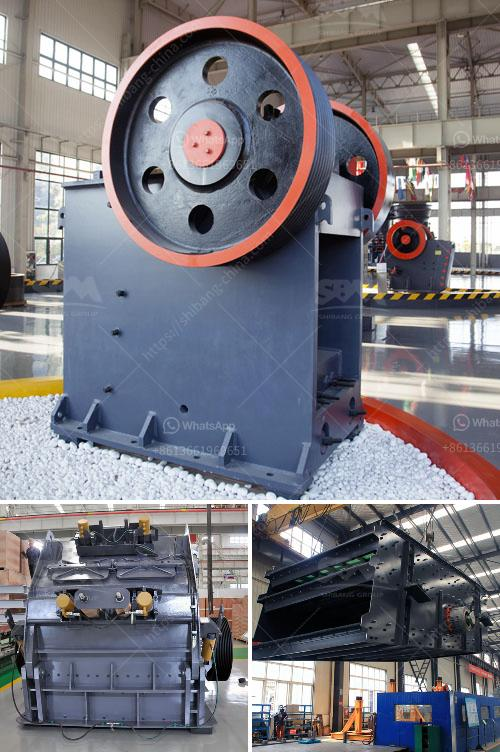

<h3>hammer mill impactor marble machina</h3>
The hammer mill impactor marble machina is an industrial machine that crushes large-size rocks or stones into smaller pieces. These machines have an impact-based design, which produces a high-speed collision impact force. This force helps to break down the material into smaller, more manageable sizes.

The primary purpose of the hammer mill impactor marble machina is to reduce the size of raw materials, such as marble, limestone, granite, and other similar materials. This reduction process is essential for various industries, including construction, mining, and metallurgy. The smaller particle size facilitates easier handling, transportation, and processing of the materials.

The hammer mill impactor marble machina operates by using a rotating shaft with a hammer or blow bar attached. As the shaft rotates, the hammers strike the incoming material, applying a significant impact force. This impact force breaks down the material, causing it to fracture into smaller pieces. The size of the final product is determined by several factors, including the size and speed of the rotating shaft, the number and size of the hammers, and the type of material being processed.

The hammer mill impactor marble machina offers several advantages over other crushing machines. Firstly, it is capable of handling a wide range of materials, from soft to hard and abrasive. Secondly, it has a high throughput capacity and can process large quantities of material in a short time. Additionally, it has a simple design and requires minimal maintenance.

In conclusion, the hammer mill impactor marble machina is a powerful industrial machine that efficiently crushes large-size rocks or stones into smaller, more manageable sizes. Its impact-based design and high-speed collision force make it ideal for various industries, offering advantages such as versatility, high throughput capacity, and low maintenance requirements.
<h3>Contact us</h3><ul><li><strong>Whatsapp:&nbsp;<a href="https://wa.me/8613661969651">+8613661969651</a></strong></li><li><a href="https://swt.shibang-china.com/?git&amp;zhl&amp;hammer mill impactor marble machina"><strong>Online Service(chat now)</strong></a></li></ul><h3>Related</h3><ul><li><a href='feldspar ball mill porcess.md'>feldspar ball mill porcess</a></li><li><a href='bentonite powder mill manufacturers.md'>bentonite powder mill manufacturers</a></li><li><a href='sewa stone crusher plant.md'>sewa stone crusher plant</a></li><li><a href='nigeria inpactor crushers price.md'>nigeria inpactor crushers price</a></li><li><a href='small scale aggregate crushing machine.md'>small scale aggregate crushing machine</a></li></ul>