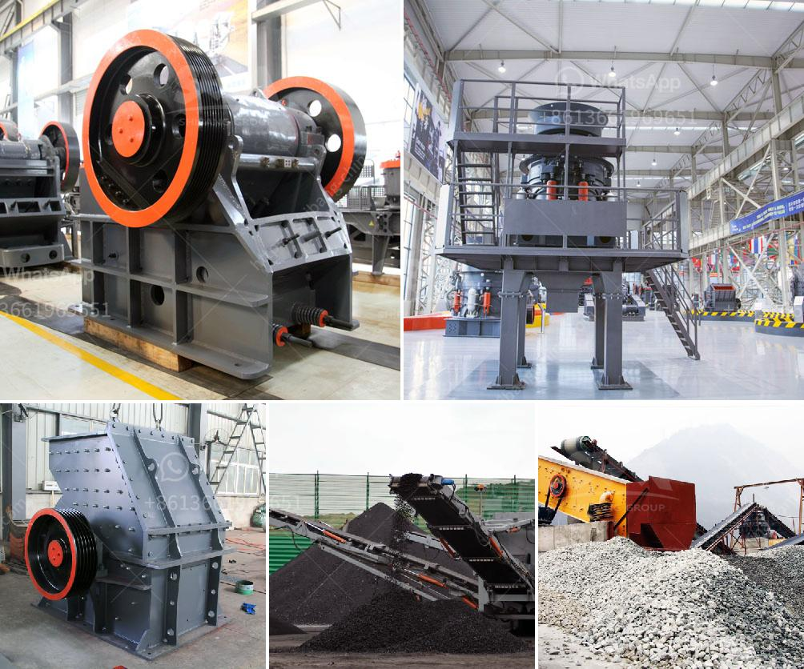

<h3>hammer mill in china</h3>
The hammer mill has a strong presence in the Chinese market and is one of the most popular machines in the country. It can be seen in many industries, including mining, construction, chemical engineering, and metallurgy. This machine is typically used to grind various materials into finer particles and is a vital component of many manufacturing processes.

One of the notable features of the hammer mill in China is its ability to crush difficult and fibrous materials. This is accomplished through high-speed rotating hammers that strike the material and break it into smaller pieces. The hammer mill's versatility allows it to handle a wide range of materials, from coal and limestone to gypsum and graphite. This is why it is often used in the mining industry for processing raw ore materials.

In addition to its crushing capabilities, the hammer mill can also be used for grinding, which makes it an ideal machine for recycling or reusing materials. For example, in the construction industry, waste materials can be pulverized and turned into filler for concrete and other building materials. This promotes sustainability and reduces the need for extracting new resources.

The Chinese hammer mill manufacturers are known for their strict quality control measures. They adhere to stringent standards and regulations to ensure that their machines meet the highest level of performance and durability. This is important because the hammer mill is often subjected to heavy-duty operations that require it to withstand a lot of wear and tear. By investing in a reliable and well-made hammer mill from a reputable manufacturer, businesses can rest assured that they are getting a machine that will deliver consistent results and require minimal maintenance.

Another advantage of the hammer mill in China is its cost-effectiveness. Compared to other grinding and crushing machines, the hammer mill is relatively affordable. This makes it accessible to small and medium-sized enterprises that may not have the budget to invest in more expensive equipment. The hammer mill's efficiency and versatility also contribute to cost savings in the long run, as it can handle a variety of materials and reduce the need for additional machinery or equipment.

Overall, the hammer mill in China has proven to be an indispensable machine in various industries. Its ability to crush and grind materials, along with its cost-effectiveness and durability, make it a favored choice among businesses. As the Chinese market continues to grow and evolve, the hammer mill manufacturers are likely to innovate and improve upon this already popular machine, further cementing its presence in the industry.
<h3>Contact us</h3><ul><li><strong>Whatsapp:&nbsp;<a href="https://wa.me/8613661969651">+8613661969651</a></strong></li><li><a href="https://swt.shibang-china.com/?git&amp;zhl&amp;hammer mill in china"><strong>Online Service(chat now)</strong></a></li></ul><h3>Related</h3><ul><li><a href='runner crusher china price.md'>runner crusher china price</a></li><li><a href='how to setup the manganese ore processing plant.md'>how to setup the manganese ore processing plant</a></li><li><a href='business plan on quarry crusher.md'>business plan on quarry crusher</a></li><li><a href='looking for limestone crushing contractor.md'>looking for limestone crushing contractor</a></li><li><a href='high energy ball milling process.md'>high energy ball milling process</a></li></ul>