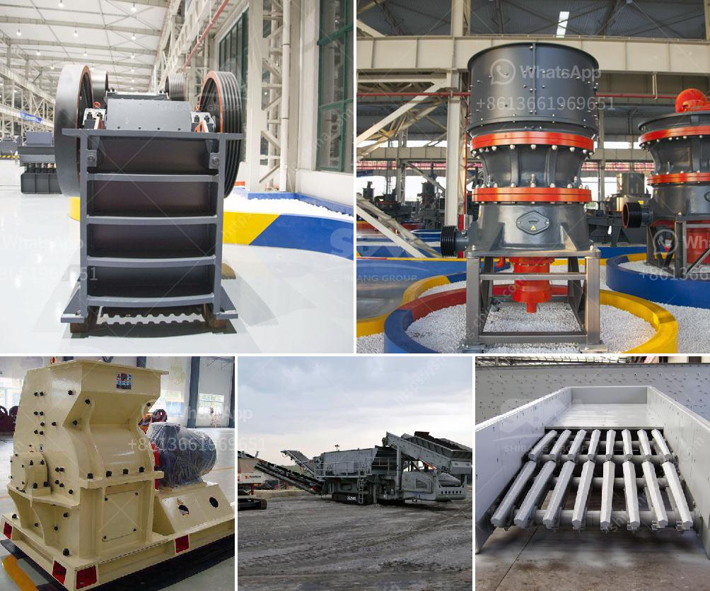

<h3>hammer mill rock crusher</h3>
Since millions of years ago, rocks have been used for various purposes. Over time, the methods and tools used to crush and extract rocks have evolved, leading to the invention of a wide range of crushing equipment. One of the most popular and widely used crushers is the hammer mill.

A hammer mill is a rock crusher that employs a rain of hammer blows to shatter and disintegrate a variety of materials. Hammer mills produce a finished product size that is dependent upon the following criteria:

Hammer mills are versatile machines for material size reduction. Applied to ore milling applications, our hammer mills can produce flour-fine rock powder. Glass pulverizing, rock recycling, porcelain recycling, and similar material reduction projects achieve slightly variable output sizes from powder to rice-grain sized discharge, per operator specifications.

An essential aspect of any hammer mill crusher is its rotor with the hammers. The rotor consists of the main shaft, disc, pins, and hammers. The motor drives the rotor to rotate at high speed in the crushing chamber, where the materials are fed into the machine. The hammers strike the materials until they are shattered into smaller pieces.

The main advantages of using a hammer mill rock crusher include reducing rock grains or particles from approximately 1-4 inches to almost dust, making them usable for site erosion control, crushing of rocks, concrete, and recycling of unwanted demolition and construction waste.

Our hammer mills are capable of quickly and effectively crushing materials such as limestone, coal, gypsum, shale, and more. They are ideal for a range of industries and applications, including cement, limestone, sand, gravel, asphalt, glass, and more.

Furthermore, our hammer mill rock crushers are easy to maintain as they come with adjustable settings to accommodate different materials and feed sizes. Regular maintenance, including inspection, cleaning, and lubrication, ensures smooth operation for an extended period.

Another benefit of using a hammer mill rock crusher is its affordability. While a wide range of crushers are available on the market, hammer mills tend to be significantly cheaper to purchase and operate. Depending on the model, hammer mills may offer a considerable cost saving compared to alternative crushing methods.

In conclusion, the hammer mill rock crusher plays a significant role in a wide range of industries, including mining, construction, and waste management. By rapidly crushing and pulverizing materials, it effectively and efficiently accomplishes a variety of crushing tasks. With advancements in technology, hammer mills have become robust and versatile machines that can handle a wide range of materials and applications. So, if you're looking for a cost-effective and reliable crusher, a hammer mill rock crusher may be the perfect choice for you.
<h3>Contact us</h3><ul><li><strong>Whatsapp:&nbsp;<a href="https://wa.me/8613661969651">+8613661969651</a></strong></li><li><a href="https://swt.shibang-china.com/?git&amp;zhl&amp;hammer mill rock crusher"><strong>Online Service(chat now)</strong></a></li></ul><h3>Related</h3><ul><li><a href='roller mill calcium.md'>roller mill calcium</a></li><li><a href='jaw crusher pe 1000 x.md'>jaw crusher pe 1000 x</a></li><li><a href='mobile stone crusher price in india.md'>mobile stone crusher price in india</a></li><li><a href='stone crusher made in malaysia.md'>stone crusher made in malaysia</a></li><li><a href='talc powder conveying systems.md'>talc powder conveying systems</a></li></ul>