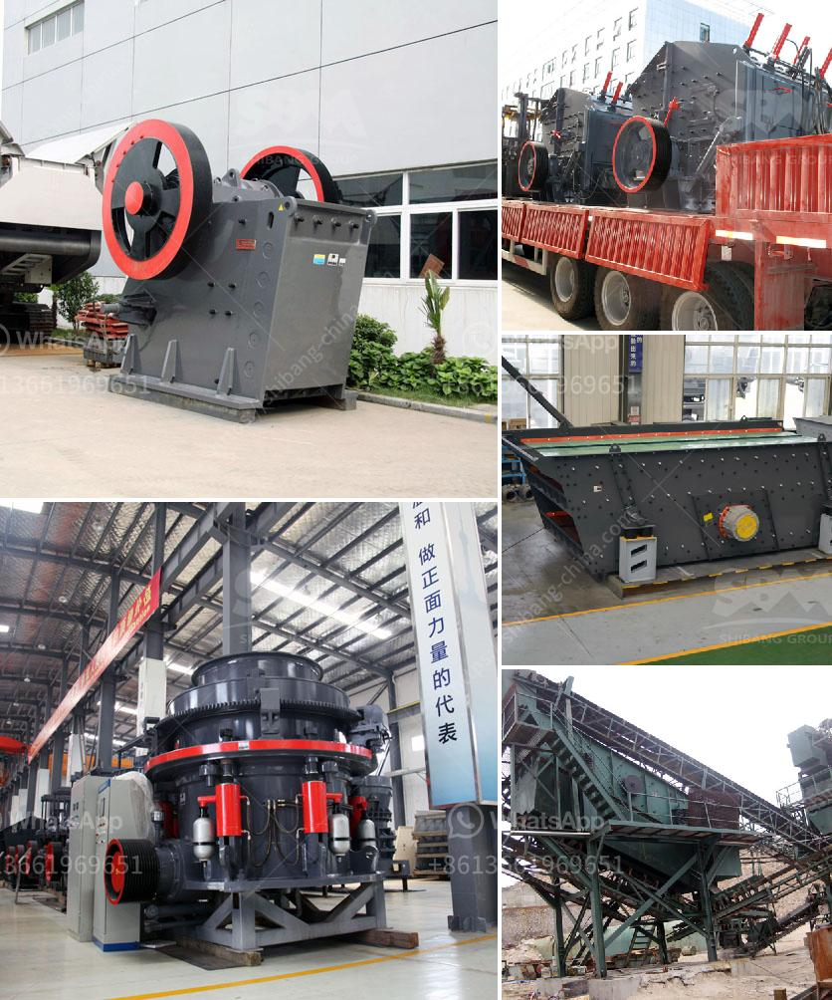

<h3>hammer mill zimbabwe</h3>
The hammer mill is a vital processing machine in the agricultural industry as it efficiently grinds and crushes various grains and maize into a fine consistency. These mills are commonly used in rural areas where electricity is limited or unavailable. However, many farmers in Zimbabwe have recognized the importance of this machine in improving rural farming practices.

In Zimbabwe, the majority of rural farmers grow maize, sorghum, and other grains. This abundant produce is often used as animal feed, an essential component in livestock rearing. Previously, farmers used manual methods like grinding stones to crush the grains into smaller particles, which was time-consuming and inefficient.

The introduction of the hammer mill has significantly improved grain processing for these farmers. Now, they can quickly and cost-effectively grind grains into animal feed materials. This machine comes with a high-speed hammer that can crush and grind a variety of grains, making it suitable for producing livestock feed materials.

The hammer mill is driven by an electric motor, which helps to minimize maintenance costs and downtime. It also has a robust construction that ensures durability and longevity. Additionally, the hammer mill is capable of working 24/7, which means farmers can efficiently produce large quantities of animal feed.

Furthermore, the hammer mill is versatile as it can produce different sizes of feed particles, ensuring that farmers can cater to the specific needs of their livestock. This customization capability is particularly crucial for farmers who rear animals with varying nutritional requirements.

In conclusion, the hammer mill has revolutionized the agricultural sector in Zimbabwe, providing a cost-effective solution to farmers' grain processing needs. As a result, farmers have been able to produce high-quality animal feed materials, enhancing their livestock rearing practices. The hammer mill has undoubtedly contributed to increasing productivity and income levels for rural farmers in Zimbabwe.
<h3>Contact us</h3><ul><li><strong>Whatsapp:&nbsp;<a href="https://wa.me/8613661969651">+8613661969651</a></strong></li><li><a href="https://swt.shibang-china.com/?git&amp;zhl&amp;hammer mill zimbabwe"><strong>Online Service(chat now)</strong></a></li></ul><h3>Related</h3><ul><li><a href='suppliers chrome mining equipment in zimbabwe.md'>suppliers chrome mining equipment in zimbabwe</a></li><li><a href='calculation of cement ball mill capacity.md'>calculation of cement ball mill capacity</a></li><li><a href='silica washing plant.md'>silica washing plant</a></li><li><a href='clinker grinding mill machine germany.md'>clinker grinding mill machine germany</a></li><li><a href='puzzolana lime stone crushing plant.md'>puzzolana lime stone crushing plant</a></li></ul>