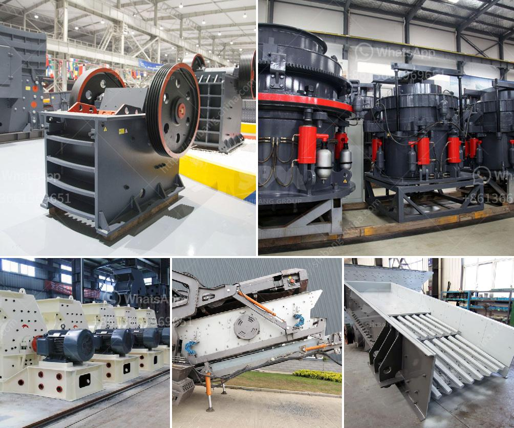

<h3>hammer mills for bricks and blocks</h3>
In the world of construction, bricks and blocks are indispensable materials. These versatile building components are utilized in a wide range of applications, from residential houses to commercial buildings and even roadways and bridges. With the increasing demand for these products, manufacturers are constantly seeking innovative ways to improve production efficiency and quality. One such innovation that has revolutionized the brick and block industry is the hammer mill.

Hammer mills are machines designed to shred or crush materials into smaller pieces. They are used in a variety of industries including building materials, waste management, and recycling. Bricks and blocks are a common waste material generated on construction sites, and hammer mills help convert them into usable materials.

One of the primary benefits of utilizing hammer mills for brick and block production is the reduction in waste. Construction sites often generate large amounts of unwanted material, including broken bricks and concrete blocks. In the past, these materials were either disposed of in landfills, resulting in environmental pollution, or crushed using costly machinery. However, with the advent of hammer mills, manufacturers can now repurpose these waste materials by feeding them into the machine.

Hammer mills work by repeatedly striking the materials with high-speed rotating hammers. This impact breaks down the bricks and blocks into smaller fragments, which can then be used as aggregate in new brick or block production. The versatile nature of hammer mills allows them to handle various types of waste materials, including old or damaged bricks, concrete blocks, and even mixed construction waste.

In addition to waste reduction, hammer mills offer several other advantages for brick and block manufacturers. Firstly, using recycled materials through the hammer mill process reduces the overall production cost. Instead of purchasing new materials, manufacturers can repurpose waste, resulting in significant cost savings. This not only benefits the bottom line but also encourages sustainability and environmental responsibility.

Another advantage of hammer mills is their ability to produce consistent and high-quality material. By controlling factors such as rotor speed and screen size, manufacturers can adjust the final product's particle size and shape. This level of control ensures uniformity, essential in the brick and block industry, where consistent dimensions are crucial.

Furthermore, hammer mills are efficient and can process large volumes of waste material in a relatively short amount of time. This increased productivity translates to greater output and higher profitability for manufacturers. It also reduces the need for manual labor, as hammer mills can be automated for continuous operation.

In conclusion, hammer mills have revolutionized brick and block production by offering an efficient and sustainable solution for waste material recycling. These machines reduce waste, minimize production costs, and consistently deliver high-quality products. Manufacturers embracing hammer mills can not only improve their profit margins but also contribute to the preservation of the environment. As the construction industry continues to prioritize sustainability, hammer mills are sure to play a vital role in the future of brick and block manufacturing.
<h3>Contact us</h3><ul><li><strong>Whatsapp:&nbsp;<a href="https://wa.me/8613661969651">+8613661969651</a></strong></li><li><a href="https://swt.shibang-china.com/?git&amp;zhl&amp;hammer mills for bricks and blocks"><strong>Online Service(chat now)</strong></a></li></ul><h3>Related</h3><ul><li><a href='stone crusher powder which products in use in philippines.md'>stone crusher powder which products in use in philippines</a></li><li><a href='quartz powder making machine.md'>quartz powder making machine</a></li><li><a href='crusher plant in peshawar.md'>crusher plant in peshawar</a></li><li><a href='ball mill price list.md'>ball mill price list</a></li><li><a href='barite grinding plant machine sale.md'>barite grinding plant machine sale</a></li></ul>