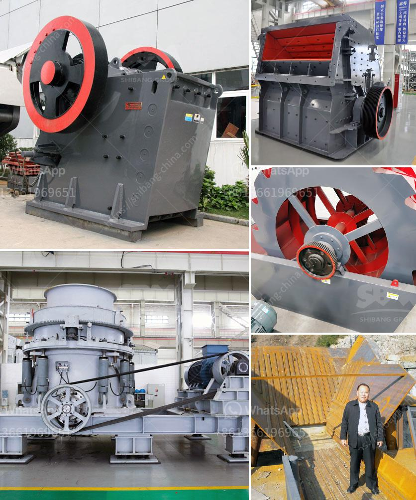

<h3>hammer mills south africa</h3>
Hammer mills are used to crush or shred various materials into smaller pieces. This is essential in many industries, such as food processing, mining, recycling, and agricultural. Hammer mills in South Africa have grown in popularity due to their efficiency in grinding down various materials. They have a long history in the agricultural sector, but today are used in a wide range of industries.

One of the key advantages of a hammer mill in South Africa is its ability to produce a wide range of particle sizes. This allows operators to create different products to meet specific customer requirements. The hammer mill can produce coarse to fine particle sizes in just one pass, making it an efficient option for many applications.

Additionally, these mills are known for their durability and low maintenance requirements. This is crucial for industries that require continuous operation and high-volume production. The robust construction of the hammer mill ensures that it can withstand heavy use and demanding conditions.

Moreover, hammer mills offer flexibility in terms of the materials they can process. They are capable of grinding a variety of materials, including grains, biomass, wood, metal scrap, and more. This versatility makes them a valuable tool in many industries, as operators can easily switch from one material to another without significant downtime or additional equipment.

Hammer mills in South Africa have also been developed with safety in mind. Many models are equipped with safety features that prevent accidents and protect operators. These safety features can include electronic controls, safety switches, and protective hoods.

In conclusion, hammer mills in South Africa play a crucial role in various industries. Their ability to grind down materials efficiently, produce a wide range of particle sizes, and their durability and low maintenance requirements make them an ideal choice for many businesses. With their versatility and safety features, hammer mills are becoming an indispensable tool for countless applications in the country.
<h3>Contact us</h3><ul><li><strong>Whatsapp:&nbsp;<a href="https://wa.me/8613661969651">+8613661969651</a></strong></li><li><a href="https://swt.shibang-china.com/?git&amp;zhl&amp;hammer mills south africa"><strong>Online Service(chat now)</strong></a></li></ul><h3>Related</h3><ul><li><a href='price limestone rock crusher.md'>price limestone rock crusher</a></li><li><a href='hydrosizer sand making machine in south africa.md'>hydrosizer sand making machine in south africa</a></li><li><a href='dubai dolomite crusher suppliers.md'>dubai dolomite crusher suppliers</a></li><li><a href='ball mill price list philippines.md'>ball mill price list philippines</a></li><li><a href='stationary crushers and screens.md'>stationary crushers and screens</a></li></ul>