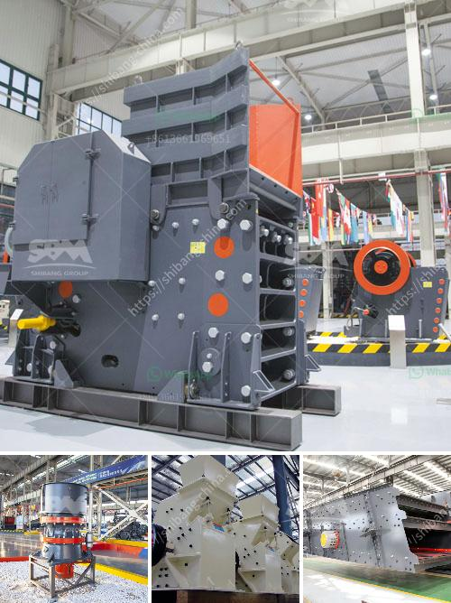

<h3>handmade stone crusher</h3>
A stone crusher, also known as rock crusher, is one of the most commonly used mining equipment. It is designed to reduce large rocks into smaller rocks or gravel. Extensive use of earth-moving equipment, blasting, and drilling are essential in the production of most stone products.

Stone crushers are primarily small scale industries mostly owned and operated by less educated individuals. The lower investment cost of these crushers makes them a cost-effective option compared to other larger stone crushers. However, the demand for crushed stone remains high as its application in various industries continues to expand.

Handmade stone crushers are becoming increasingly rare, as the demand for more efficient technology increases. These machines are often made by local artisans, using materials that are readily available. Handmade stone crushers are often used as a way to reduce waste and utilize leftover materials.

The process of making a handmade stone crusher is relatively simple. The basic components required include a breaking hammer, a chain, a metal plate, an axle, and a wheel. Once these components are assembled, the crusher can be manually operated by turning the wheel. The metal plate is used to break larger rocks into smaller pieces, which can then be used in various applications such as construction, landscaping, or road building.

Although handmade stone crushers may not be as efficient or powerful as their modern counterparts, they still serve a purpose in certain situations. For instance, in remote areas with limited access to electricity or mechanized equipment, handmade stone crushers can be a viable solution. They offer a cost-effective alternative for small-scale projects, providing a means of reducing waste and producing useful materials.

In conclusion, handmade stone crushers are a unique and resourceful approach to stone crushing. Although they may lack the efficiency and power of modern machines, they can still be a valuable asset in certain situations. As technology continues to advance, it is crucial to preserve and appreciate traditional methods of production, such as handmade stone crushers.
<h3>Contact us</h3><ul><li><strong>Whatsapp:&nbsp;<a href="https://wa.me/8613661969651">+8613661969651</a></strong></li><li><a href="https://swt.shibang-china.com/?git&amp;zhl&amp;handmade stone crusher"><strong>Online Service(chat now)</strong></a></li></ul><h3>Related</h3><ul><li><a href='stone crushing machines for brick making.md'>stone crushing machines for brick making</a></li><li><a href='coal pulverizer crusher manufacturers.md'>coal pulverizer crusher manufacturers</a></li><li><a href='components of a ball mill.md'>components of a ball mill</a></li><li><a href='quartz powder making machine.md'>quartz powder making machine</a></li><li><a href='ball mill 3 ton.md'>ball mill 3 ton</a></li></ul>