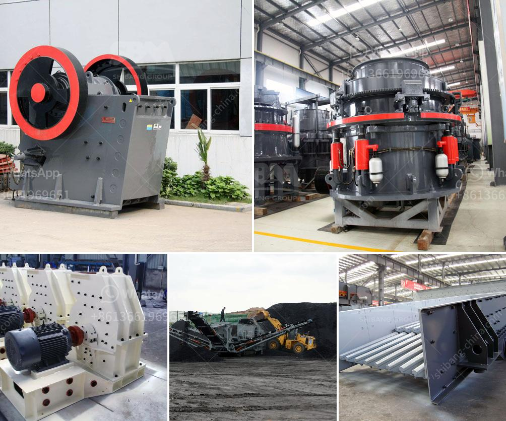

<h3>harga jaw crusher x</h3>
The jaw crusher is a widely used piece of equipment that plays an important role in many processing industries. It is known for its ability to crush hard materials, including rocks and ores, with its strong and sturdy structure. With the rising demand for crushed materials in various industries, the need for efficient and reliable jaw crushers has increased. In this article, we will explore the features and benefits of the harga jaw crusher x and why it is an excellent choice for your crushing needs.

The harga jaw crusher x is built with quality materials and advanced technology, ensuring its durability and long lifespan. It is equipped with a powerful motor that enables it to deliver high crushing efficiency. The machine's jaw chamber is designed to handle even the toughest materials, thanks to its robust construction and heavy-duty components.

With a jaw size of x, this crusher is suitable for crushing a wide range of materials. It has a large feed opening, allowing for easy feeding of large-sized materials. Whether you need to crush hard rocks, ores, or construction waste, the harga jaw crusher x can handle them all.

1. High Crushing Capacity: The harga jaw crusher x is designed to deliver high crushing capacity, making it suitable for large-scale processing operations. This enables you to crush more materials in a shorter period, increasing overall productivity.

2. Efficient Operation: The jaw crusher x is equipped with a hydraulic system that ensures smooth and efficient operation. It has a simple control panel, allowing for easy operation and adjustment of the crusher settings. Additionally, it has a low energy consumption, helping to reduce operating costs.

3. Versatility: The harga jaw crusher x can be used in various applications, making it a versatile solution for different industries. Whether you need to crush rocks for construction purposes or process ores for mineral extraction, this crusher can handle the job efficiently.

4. Low Maintenance: This jaw crusher is designed for minimal maintenance requirements, allowing you to focus on your core operations. It is built with high-quality components that are resistant to wear and tear, reducing the need for frequent repairs.

The harga jaw crusher x is a reliable and efficient crushing machine that offers excellent performance in various applications. With its high crushing capacity, efficient operation, and low maintenance requirements, it is a valuable asset for any processing industry. Whether you are involved in mining, construction, or recycling, this jaw crusher can help you achieve your crushing goals effectively. Consider investing in the harga jaw crusher x to enhance your operations and improve productivity.
<h3>Contact us</h3><ul><li><strong>Whatsapp:&nbsp;<a href="https://wa.me/8613661969651">+8613661969651</a></strong></li><li><a href="https://swt.shibang-china.com/?git&amp;zhl&amp;harga jaw crusher x"><strong>Online Service(chat now)</strong></a></li></ul><h3>Related</h3><ul><li><a href='rubber conveyor belt pdf.md'>rubber conveyor belt pdf</a></li><li><a href='canadia crusher portable chassis.md'>canadia crusher portable chassis</a></li><li><a href='bauxite crushing machine in maharashtra.md'>bauxite crushing machine in maharashtra</a></li><li><a href='barite grinding plant machine sale.md'>barite grinding plant machine sale</a></li><li><a href='gypsum powder making plant.md'>gypsum powder making plant</a></li></ul>