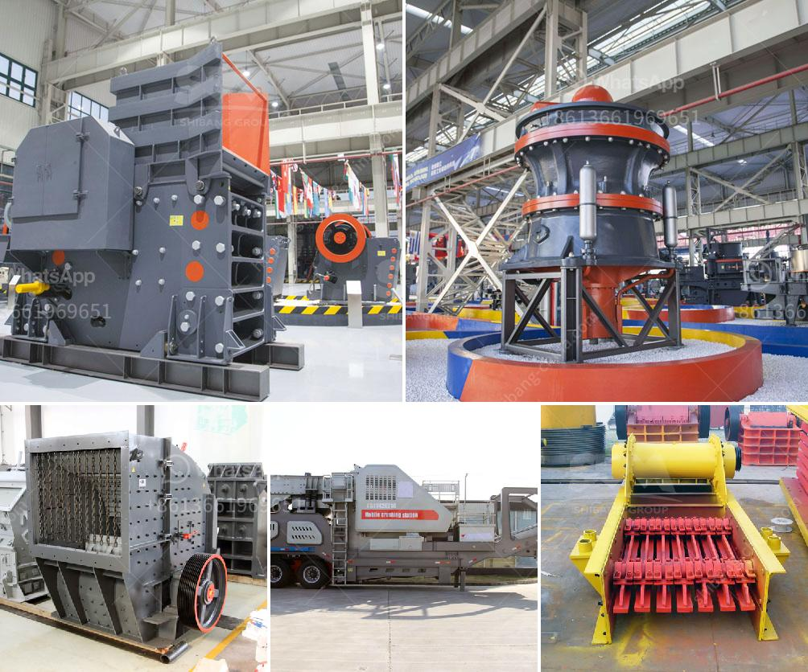

<h3>harga mobile crusher in indonesia</h3>
The mobile crusher is applied to multistage crush large materials, and then screens the discharges according to their different specifications. The whole set plants is widely used to mine, building material, highway, rail way and hydropower industries, etc., finish crushing and screening operations at one time, produce required size and output for consumers.

Indonesia is one of the largest producers of mobile crushers in the world. The country has abundant mineral resources such as coal, copper, iron ore, limestone, and gold. The demand for mobile crushers and screeners is booming highly attributed to the growing urbanization and infrastructural growth in Indonesia. The steady rise in the mining sector and increasing industrialization are driving demand for mobile crushers in the country.

When it comes to mobile crushing equipment, the latest technological innovations are constantly improving operator safety and productivity. Mobile crushers have become an essential tool in mining, construction, and quarrying operations. The availability of various models and advanced technologies makes it easier for industries to select the most suitable mobile crusher for their specific needs.

The price of mobile crushers in Indonesia varies widely, depending on the brand, size, capacity, and specifications. Harga mobile crusher is also influenced by factors such as market demand, technological advancements, and government regulations. To understand the specific needs of the market and the latest pricing trends, potential buyers are advised to conduct thorough market research and compare prices from different suppliers and manufacturers.

Moreover, in addition to the purchase price of the mobile crusher, buyers should consider various factors such as operation and maintenance costs, transportability, and after-sales services. The total cost of ownership should be evaluated to ensure that the investment in a mobile crusher provides long-term value.

Indonesia has a highly competitive mobile crusher market with various domestic and international manufacturers competing for market share. In order to stand out from the competition, manufacturers focus on providing their customers with products that offer advanced features, durability, and efficiency. Manufacturers also invest in research and development to enhance technological innovations and provide cost-effective solutions.

Some of the leading manufacturers of mobile crushers in Indonesia include Metso, Sandvik, Kleemann, Terex, and Powerscreen. These companies provide a wide range of mobile crushers with different specifications, ensuring that buyers can find the most suitable equipment for their specific applications.

In conclusion, the mobile crusher market in Indonesia is witnessing significant growth due to the increasing demand for mobile crushers in various industries. The steady rise in mining activities and infrastructure development has further fueled the demand for these versatile machines. The price of mobile crushers in Indonesia depends on various factors such as brand, size, capacity, and specifications. Potential buyers are advised to conduct thorough market research and consider all relevant factors before making a purchasing decision. Ensuring long-term value and considering after-sales services are also crucial aspects to consider when investing in a mobile crusher.
<h3>Contact us</h3><ul><li><strong>Whatsapp:&nbsp;<a href="https://wa.me/8613661969651">+8613661969651</a></strong></li><li><a href="https://swt.shibang-china.com/?git&amp;zhl&amp;harga mobile crusher in indonesia"><strong>Online Service(chat now)</strong></a></li></ul><h3>Related</h3><ul><li><a href='crusher for sale egypt.md'>crusher for sale egypt</a></li><li><a href='machines de crushine primaires.md'>machines de crushine primaires</a></li><li><a href='business plan for a cement plant.md'>business plan for a cement plant</a></li><li><a href='limestone processing equipment in south africa.md'>limestone processing equipment in south africa</a></li><li><a href='jaw crusher in kenya.md'>jaw crusher in kenya</a></li></ul>