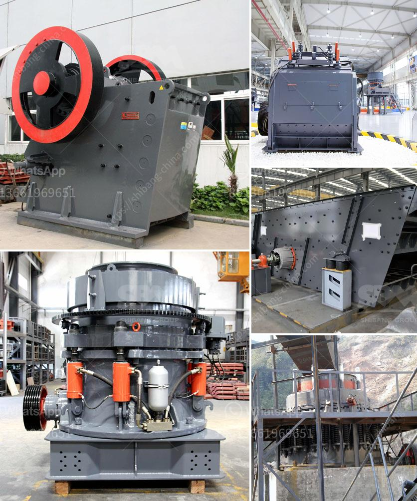

<h3>harga stone crusher mini bekas</h3>
Stone crusher is a machine used to process various kinds of minerals, such as rocks, stone, granite, etc. It is often used as a primary crusher or secondary crusher. The mini stone crusher machine, also known as small stone crusher, is designed to crush soft and hard rocks into medium or fine stones. It is widely used in various industries, such as mining, cement, construction, chemistry, and more.

One of the benefits of mini stone crusher is its ability to crush materials into smaller sizes. This characteristic makes it easier for users to control the size of the crushed materials, whether it is used for road construction, building construction, or other purposes. The mini stone crusher is also equipped with a powerful motor that helps to improve its efficiency.

Harga stone crusher mini bekas is a machine that crushes raw materials into smaller sizes. The mini stone crusher is suitable for crushing various types of minerals, such as rocks, marble, granite, travertine, basalt, limestone, quartz, river pebbles, iron ore, copper ore, etc. The mini stone crusher machine price range is widely used in mining, smelting, building materials, highway, railway, water conservancy, chemical industry and many other departments.

One of the main advantages of the mini stone crusher is its cost-effective price range. The mini stone crusher price will be competitive compared to other types of crushers. Mini stone crusher machine price includes vibrating feeder, jaw crusher, impact crusher, vibratingscreen, belt conveyor and so on. When the materials enter the jaw crusher, they are crushed into small pieces by the in-between positioned jaw plates. As the movable jaw moves back and forth against the fixed jaw, the materials are crushed with continuous pressure and friction.

The mini stone crusher is also equipped with an accurate and efficient control system. The whole process can be controlled through a wireless remote control, which makes it easy to operate and maintain. The mini stone crusher also comes with a safety device called a toggle plate. This device provides an additional layer of protection, preventing any physical damage to the mini stone crusher or its operators.

In conclusion, the mini stone crusher is a cost-effective and efficient way to process materials into smaller sizes. With its compact design and powerful motor, it can easily crush various types of minerals. The mini stone crusher is widely used in various industries, such as mining, cement, construction, chemistry, and more. Its competitive price range and efficient control system make it a popular choice among customers. So, if you are looking for a machine to crush rocks and stones, the harga stone crusher mini bekas is definitely worth considering!
<h3>Contact us</h3><ul><li><strong>Whatsapp:&nbsp;<a href="https://wa.me/8613661969651">+8613661969651</a></strong></li><li><a href="https://swt.shibang-china.com/?git&amp;zhl&amp;harga stone crusher mini bekas"><strong>Online Service(chat now)</strong></a></li></ul><h3>Related</h3><ul><li><a href='south africa suppliers of chrome ore beneficiation plant.md'>south africa suppliers of chrome ore beneficiation plant</a></li><li><a href='copper slag grinding machine in chennai.md'>copper slag grinding machine in chennai</a></li><li><a href='crusher machine factories in coimbatore.md'>crusher machine factories in coimbatore</a></li><li><a href='coconut shell powder making machine grinding mill for sale.md'>coconut shell powder making machine grinding mill for sale</a></li><li><a href='crushing and screening costs.md'>crushing and screening costs</a></li></ul>