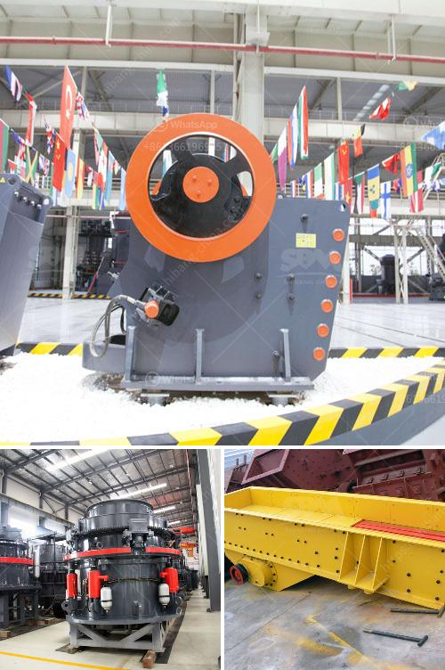

<h3>harga stone crusher plant merk</h3>
Stone crushing plant merupakan salah satu jenis mesin yang digunakan untuk memecahkan batu menjadi beberapa bagian. Bagian-bagian yang kecil tersebut disebut dengan split. Salah satu merk dari stone crusher plant yang cukup terkenal adalah merk Shanbao. Stone crusher plant merk Shanbao ini memiliki kapasitas produksi yang sangat besar, sehingga mampu memecahkan batu dengan ukuran yang relatif besar. Harga stone crusher plant merk Shanbao ini cukup terjangkau untuk Anda yang sedang membangun atau renovasi rumah.

Harga stone crusher plant merk Shanbao dengan kapasitas 100 ton/ jam, 150 ton/ jam, 250 ton/ jam, 300 ton/ jam, dan 500 ton/ jam adalah sebagai berikut:

Harga stone crusher plant merk Shanbao di atas belum termasuk biaya transportasi, instalasi, dan komisi. Harga tersebut dapat berubah sewaktu-waktu mengikuti harga bahan-bahan yang digunakan pada pembuatan stone crusher plant.

Stone crusher plant merk Shanbao ini dapat digunakan untuk memecahkan berbagai jenis batu seperti batu kali, batu gunung, batu kapur, batu bara, dan sebagainya. Stone crusher plant ini bekerja dengan mengandalkan gaya tekan, seperti halnya dengan jaw crusher. Namun, mesin ini lebih cocok digunakan dalam industri konstruksi, jalan raya, dan pertambangan.

Kualitas dari stone crusher plant merk Shanbao ini juga terjamin. Mesin ini menggunakan bahan-bahan berkualitas tinggi dan telah melalui proses perakitan yang ketat. Dengan demikian, keamanan dan performa mesin ini sangatlah baik.

Selain itu, stone crusher plant merk Shanbao ini juga dilengkapi dengan berbagai fitur canggih. Salah satunya adalah adanya kontrol untuk mengatur kecepatan dan arah putaran mesin. Hal ini sangat penting untuk mengatur hasil produksi agar sesuai dengan kebutuhan.

Berbagai kelebihan tersebut membuat harga stone crusher plant merk Shanbao terlihat sangat sesuai dengan kualitas yang diberikan. Mesin ini menjadi solusi terbaik bagi Anda yang memerlukan stone crusher plant dengan kapasitas produksi besar, tetapi tetap mempertimbangkan harga yang terjangkau.

Apabila Anda tertarik untuk membeli stone crusher plant merk Shanbao, sebaiknya Anda melakukan konsultasi terlebih dahulu dengan penyedia atau pabrik stone crusher. Dengan melakukan konsultasi, Anda dapat mendapatkan informasi lebih detail mengenai spesifikasi, fitur, dan harga yang ditawarkan.

Dalam memilih stone crusher plant, pastikan Anda mempertimbangkan segala aspek yang berkaitan dengan kebutuhan dan anggaran. Dengan demikian, Anda dapat memilih merk dan harga stone crusher plant yang paling sesuai untuk proyek Anda.
<h3>Contact us</h3><ul><li><strong>Whatsapp:&nbsp;<a href="https://wa.me/8613661969651">+8613661969651</a></strong></li><li><a href="https://swt.shibang-china.com/?git&amp;zhl&amp;harga stone crusher plant merk"><strong>Online Service(chat now)</strong></a></li></ul><h3>Related</h3><ul><li><a href='green rock quarry in sariaya.md'>green rock quarry in sariaya</a></li><li><a href='pe 100x60 jaw crusher for laboratory.md'>pe 100x60 jaw crusher for laboratory</a></li><li><a href='concrete crusher machine.md'>concrete crusher machine</a></li><li><a href='aggregate grinding mill manufacturers in south philippines.md'>aggregate grinding mill manufacturers in south philippines</a></li><li><a href='small crusher project.md'>small crusher project</a></li></ul>