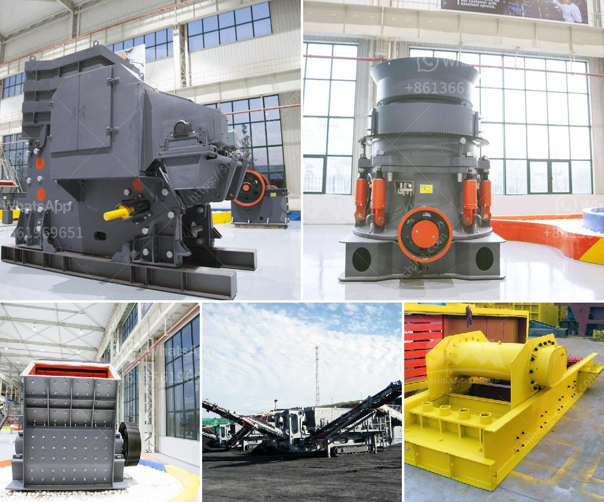

<h3>high crushing ratio low cost jaw crusher machine</h3>
We all know that jaw crushers are being applied widely in the mineral crushing due to the high reduction ratio and the uniform final product size. As they are simple machines, they are not terribly expensive to purchase and operate. There are many jaw crusher suppliers who offer affordable machines, making them very accessible for most small and medium-sized businesses.

One of the key features of a jaw crusher machine is its ability to crush large rocks into smaller pieces. The jaw crusher has a high crushing ratio thanks to its sturdy construction and technical design. This reliability makes it a widely used machine that complies with demanding requirements in both primary and secondary crushing.

Another significant benefit of jaw crushers is its low operating cost. The operating costs of a jaw crusher are mainly electricity, lubrication, and maintenance. If we consider the jaw crusher models that are available in the market, we can see that the PE jaw crusher, and the PEX jaw crusher are the most popular models. They can meet the capacity of 1-800tph, and the final product size can be adjusted to meet different needs.

One reason why the jaw crusher machine is so popular is that it has a very high reduction ratio. This means that the jaw crusher can crush large-sized rocks effectively, providing a product with a uniform particle size. In addition, the jaw crusher machine has a relatively low production cost. Compared to other types of crushing equipment, the operating and maintenance costs of the jaw crusher are cheaper.

The jaw crusher machine is highly efficient, saving a lot of labor costs. Therefore, it is a very cost-effective investment choice. Additionally, the jaw crusher machine has a simple structure and reliable operation. Once it is running, it does not require frequent maintenance. As a result, the user can save not only money but also time.

It is worth noting that the jaw crusher machine is not limited to crushing rocks. It can also be used for many other materials such as ores, concrete, ceramics, and glass. This versatility makes the jaw crusher machine a perfect choice for various industries such as mining, metallurgy, construction, and many more.

In conclusion, the jaw crusher machine is an ideal choice for those who need a reliable and efficient crushing solution. It offers high crushing ratio, low operating cost, and a wide range of applications. With its simple structure and robust design, the jaw crusher machine is a cost-effective investment that can bring significant benefits to businesses of all sizes. Whether you need a machine for primary or secondary crushing, the jaw crusher is a reliable choice for you.
<h3>Contact us</h3><ul><li><strong>Whatsapp:&nbsp;<a href="https://wa.me/8613661969651">+8613661969651</a></strong></li><li><a href="https://swt.shibang-china.com/?git&amp;zhl&amp;high crushing ratio low cost jaw crusher machine"><strong>Online Service(chat now)</strong></a></li></ul><h3>Related</h3><ul><li><a href='feasibility study of palm kernel crushing plant.md'>feasibility study of palm kernel crushing plant</a></li><li><a href='iron ore mines buyers in india.md'>iron ore mines buyers in india</a></li><li><a href='used aggregate crusher for sale in india.md'>used aggregate crusher for sale in india</a></li><li><a href='manganese limestone processing unit.md'>manganese limestone processing unit</a></li><li><a href='dolomite beneficiation.md'>dolomite beneficiation</a></li></ul>