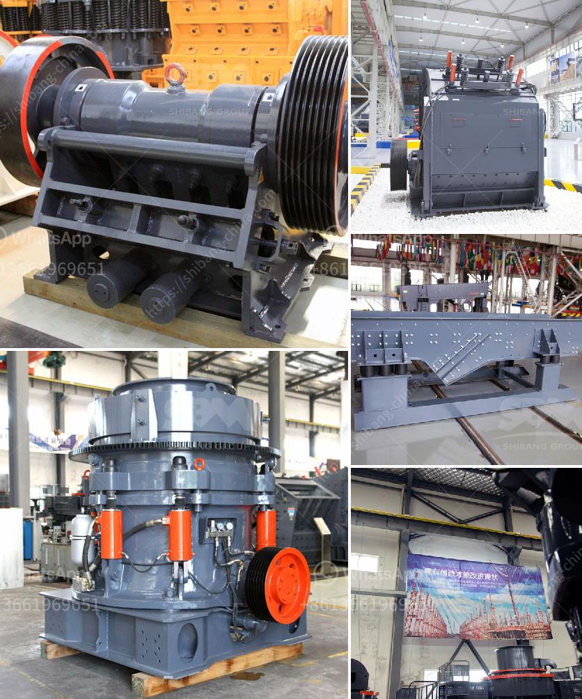

<h3>high energy ball milling process</h3>
High-energy ball milling is a technique that has been widely utilized in numerous industries for their synthesis, mechanical alloying, and activation applications. This technique involves repeated cold welding, fracturing, and rewelding of powder particles in a high-energy ball mill, resulting in the formation of nanoscale crystalline materials or metastable phases.

The process operates at ambient temperature, and it is considered an effective method for reducing the particle size of a wide range of materials, including metals, alloys, ceramics, and composites. The reduction in particle size not only enhances the material's surface area but also improves its reactivity and mechanical properties.

The high-energy ball milling process begins with the preparation of a mixture comprising the raw materials and a suitable solvent. The mixture is loaded into the milling jar, and the grinding balls are then added. The milling jar is sealed tightly and subjected to intense rotational motion at high speeds.

During milling, the grinding balls collide with the powder particles trapped between them, resulting in extensive deformation and fragmentation. The repeated impact and deformation lead to the generation of highly strained regions within the powder, enabling rapid diffusion, chemical reactions, and solid-state transformations to occur. These processes are responsible for the formation of fine and unique structures, such as nanocrystalline, amorphous, or composite materials.

The key driving force behind the high-energy ball milling process is the tremendous mechanical energy transferred to the powder mixture. This energy is influenced by several factors, including the ball-to-powder weight ratio, milling speed, milling time, and the size and number of grinding balls. By optimizing these parameters, researchers can control the extent of particle size reduction, crystallite size, grain boundary density, and defect concentration.

The high-energy ball milling process has found its applications in various fields. In materials science, it has been employed for the synthesis of functional materials with enhanced properties, including superconductors, magnetic materials, and high-strength alloys.

Another important application of high-energy ball milling is in the field of mechanical alloying. This process allows the incorporation of one material into another through repeated milling and cold welding of the powders. Mechanical alloys exhibit improved strength, hardness, and corrosion resistance compared to their constituent elements.

Additionally, high-energy ball milling has been utilized for the activation or modification of materials. By subjecting the materials to intense mechanical forces, their surfaces can undergo structural changes, chemical reactions, and even amorphization. Such surface modification enhances the reactivity and adsorption capacity of the materials, making them suitable for applications such as catalysis, gas sensing, and energy storage.

In conclusion, high-energy ball milling is a versatile and effective technique for particle size reduction and synthesis of unique materials. It offers a wide range of opportunities in various industries and research fields. With further advancements in the field, this process is expected to contribute significantly to the development of advanced materials and technologies.
<h3>Contact us</h3><ul><li><strong>Whatsapp:&nbsp;<a href="https://wa.me/8613661969651">+8613661969651</a></strong></li><li><a href="https://swt.shibang-china.com/?git&amp;zhl&amp;high energy ball milling process"><strong>Online Service(chat now)</strong></a></li></ul><h3>Related</h3><ul><li><a href='stone crusher machine for rent in kenya.md'>stone crusher machine for rent in kenya</a></li><li><a href='cost of stone crusher production line in china.md'>cost of stone crusher production line in china</a></li><li><a href='china pasir harga washing plant.md'>china pasir harga washing plant</a></li><li><a href='tonne mobile crusher for sale philippines.md'>tonne mobile crusher for sale philippines</a></li><li><a href='gold refining and essay report equipment.md'>gold refining and essay report equipment</a></li></ul>