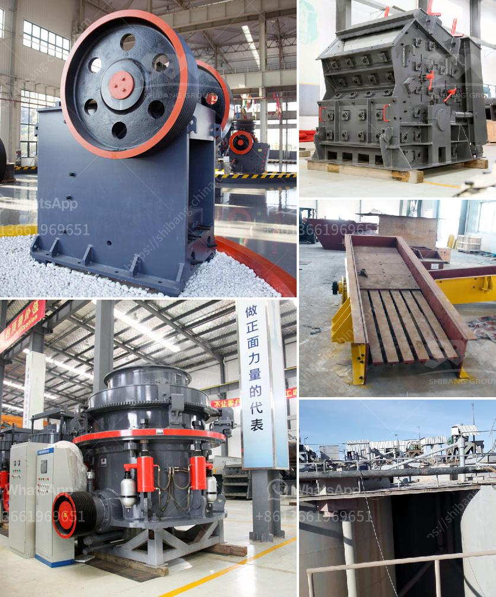

<h3>high gradient separator in zhengzhou</h3>
Zhengzhou, the capital city of Henan province in China, is at the forefront of technological advancements in various industries. One such groundbreaking development is the introduction of the high gradient separator. This innovative separation technology has the potential to revolutionize various sectors, ranging from mining to waste management, by significantly improving the efficiency and accuracy of separation processes.

High gradient separators are designed to separate fine particles from liquids or slurries based on their magnetic properties. Traditional separation methods, such as filtration or centrifugation, often struggle to efficiently separate particles with sizes below a certain threshold. However, the high gradient separator overcomes these limitations and achieves exceptional separation efficiency, even for particles as small as a few micrometers.

One of the key features of the high gradient separator is its strong magnetic force. The device utilizes high-intensity magnetic fields that can apply forces to even the tiniest particles, enabling efficient separation. This magnetic force is created by a combination of powerful magnets and a unique magnetic matrix system, ensuring that the particles are properly separated according to their magnetic properties.

In many industries, the high gradient separator has proven to be invaluable. For instance, in the mining industry, the separator can effectively separate valuable minerals from ores. This process significantly increases the yield and purity of the final product, leading to increased profitability for mining companies. Moreover, the high gradient separator eliminates the need for other cumbersome and costly separation methods, such as flotation or leaching, making it a preferred choice among mine operators.

Another significant application of the high gradient separator is in wastewater treatment and recycling. In cities like Zhengzhou, where water scarcity is a concern, it is crucial to treat and recycle wastewater effectively. The high gradient separator efficiently removes contaminants and suspended particles from wastewater, resulting in cleaner and reusable water. This saves precious freshwater resources and reduces the overall environmental impact of wastewater discharge.

Furthermore, the high gradient separator also finds application in industries dealing with the separation of microplastics. As plastic pollution becomes a global challenge, the ability to effectively and efficiently separate microplastics from water sources is of utmost importance. High gradient separators have demonstrated their capability to accurately separate microplastics from water, contributing to the preservation of marine ecosystems and protecting aquatic life.

Overall, the introduction of the high gradient separator in Zhengzhou holds immense promise for various industries. Its ability to efficiently separate fine particles with high precision provides a competitive advantage to businesses across the region. The advancements in separation technology will not only drive economic growth but also promote sustainable practices by conserving resources and reducing environmental pollution.

As demand for high gradient separators continues to rise, it is expected that further research and development will lead to even more advanced and efficient separation technologies. Zhengzhou's status as a technological hub will continue to foster innovation and propel the city to new heights in the field of separation technology. Together with other technological advancements, high gradient separators have the potential to transform industries, improve efficiency, and contribute to the overall development of the city and its surrounding regions.
<h3>Contact us</h3><ul><li><strong>Whatsapp:&nbsp;<a href="https://wa.me/8613661969651">+8613661969651</a></strong></li><li><a href="https://swt.shibang-china.com/?git&amp;zhl&amp;high gradient separator in zhengzhou"><strong>Online Service(chat now)</strong></a></li></ul><h3>Related</h3><ul><li><a href='conveyor belt supplier in riyadh.md'>conveyor belt supplier in riyadh</a></li><li><a href='construction equipment manufacturer in turkey.md'>construction equipment manufacturer in turkey</a></li><li><a href='harga stone crusher mini bekas.md'>harga stone crusher mini bekas</a></li><li><a href='industrial rotary dryers for sale india.md'>industrial rotary dryers for sale india</a></li><li><a href='kenya sand making machine.md'>kenya sand making machine</a></li></ul>