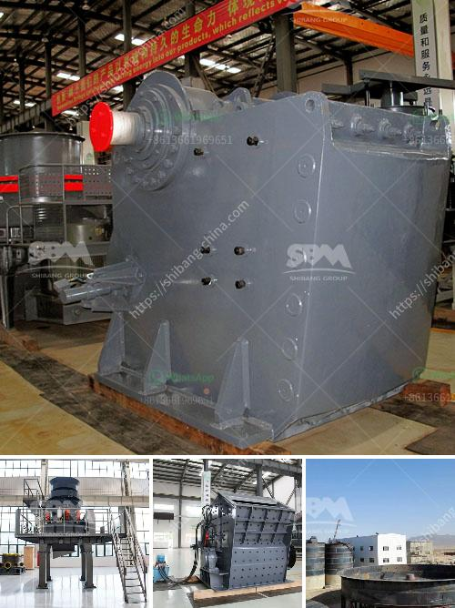

<h3>horizontal stone ball mill</h3>
The horizontal stone ball mill is an ancient grinding tool used to grind grains, herbs, and other materials. It has a cylindrical body, a hollow interior, and a grinding stone embedded in its lower part. The upper part of the mill is made of wood and has a handle for turning it manually. This ancient mill, with its simple design and efficient mechanism, has been used for centuries to produce finely ground materials.

The horizontal stone ball mill works on the principle of friction and impact. The cylindrical body of the mill rotates horizontally, causing the grinding stone to move along its axis. As the stone moves, it grinds the material placed inside the mill, resulting in the reduction of its particle size and the production of fine powder.

One of the advantages of the horizontal stone ball mill is its versatility. It can be used to grind various materials, including grains, spices, and even minerals. This makes it a valuable tool for both domestic and industrial applications. In the past, it was commonly used in households for grinding grains and herbs for cooking. Nowadays, it is also used in industries such as pharmaceuticals, cosmetics, and minerals processing.

The use of a horizontal stone ball mill ensures a gentle grinding process that does not generate excessive heat. This makes it suitable for grinding temperature-sensitive materials, such as herbs and spices, which can lose their aroma and flavor if exposed to high temperatures. The gentle grinding also prevents the degradation of the material's nutritional and medicinal properties.

Another advantage of the horizontal stone ball mill is its durability. The grinding stone, typically made of hard and abrasive materials such as granite or basalt, is designed to withstand continuous use and heavy grinding. This ensures that the mill can deliver consistent and high-quality results over an extended period.

Additionally, the simplicity of the horizontal stone ball mill allows for easy maintenance and repairs. The grinding stone can be easily replaced when worn out, and the wooden upper part can be repaired or replaced if necessary. This makes it a cost-effective grinding solution that can be used for many years without the need for significant investments in maintenance or replacement parts.

In conclusion, the horizontal stone ball mill is a reliable and versatile tool for grinding various materials. Its ancient design, coupled with its efficient and gentle grinding mechanism, makes it suitable for both domestic and industrial applications. Whether used in households or industries, this mill ensures a consistent and high-quality grinding process that preserves the properties of the materials being ground. With its durability and ease of maintenance, the horizontal stone ball mill is a valuable asset for any grinding operation.
<h3>Contact us</h3><ul><li><strong>Whatsapp:&nbsp;<a href="https://wa.me/8613661969651">+8613661969651</a></strong></li><li><a href="https://swt.shibang-china.com/?git&amp;zhl&amp;horizontal stone ball mill"><strong>Online Service(chat now)</strong></a></li></ul><h3>Related</h3><ul><li><a href='jaw crusher machine cost.md'>jaw crusher machine cost</a></li><li><a href='manufacturing cost of 6mm rolling mill.md'>manufacturing cost of 6mm rolling mill</a></li><li><a href='quarry stone crusherequipment.md'>quarry stone crusherequipment</a></li><li><a href='low cost jaw crusher price in uganda.md'>low cost jaw crusher price in uganda</a></li><li><a href='limestone powder mill.md'>limestone powder mill</a></li></ul>