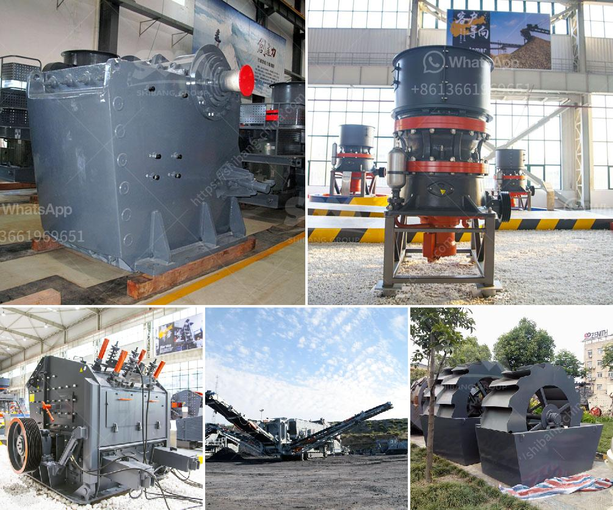

<h3>how much crusher machine</h3>
Crusher machines have become essential equipment in various industries, including mining, construction, and recycling. These machines are designed to break large stones, rocks, or other materials into smaller, more manageable sizes. They play a crucial role in increasing productivity and efficiency in a wide range of applications.

The size of crusher machines can vary, depending on the specific needs of the industry or project. Some crushers are small and portable, while others are large and stationary. Regardless of the size, these machines are capable of handling a significant amount of material.

One major advantage of crusher machines is their ability to handle a wide range of materials. They can crush hard and abrasive rocks, as well as soft and non-abrasive materials. This versatility makes them suitable for various applications, such as crushing concrete, asphalt, or natural stone.

The efficiency of these machines is another crucial factor. Crusher machines are designed to maximize the efficiency of the crushing process, reducing the time and energy required to break down the materials. This ultimately translates into reduced costs and increased productivity.

Additionally, crusher machines often come with features that enhance their performance. These features can include adjustable settings for different output sizes, automated controls for optimal operation, and safety mechanisms to protect the operator and prevent damage to the machine.

In conclusion, crusher machines are essential tools in many industries. Their ability to crush a wide range of materials, combined with their efficiency and features, make them invaluable for increasing productivity and reducing costs. Whether it's in mining, construction, or recycling, crusher machines are crucial for ensuring successful operations.
<h3>Contact us</h3><ul><li><strong>Whatsapp:&nbsp;<a href="https://wa.me/8613661969651">+8613661969651</a></strong></li><li><a href="https://swt.shibang-china.com/?git&amp;zhl&amp;how much crusher machine"><strong>Online Service(chat now)</strong></a></li></ul><h3>Related</h3><ul><li><a href='barite powder making.md'>barite powder making</a></li><li><a href='industrial mill crusher price.md'>industrial mill crusher price</a></li><li><a href='mica minerals powder grinding unit in kenya.md'>mica minerals powder grinding unit in kenya</a></li><li><a href='china crusher plant.md'>china crusher plant</a></li><li><a href='small portable swing jaw crushers.md'>small portable swing jaw crushers</a></li></ul>