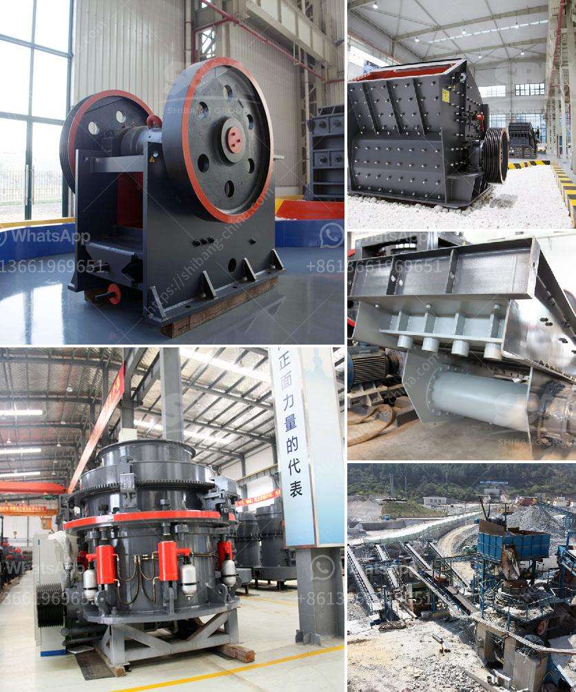

<h3>how much does coal mining machines costs</h3>
Coal mining machines are essential tools for coal mining operations. They enable the efficient extraction and transportation of coal from underground mines to the surface. Coal mining machines come in several forms, but all involve intricate and costly machinery. In this article, we will explore the costs associated with coal mining machines.

One of the primary factors affecting the cost of coal mining machines is the type of machine. There are several types of machines used in coal mining, including continuous miners, longwall miners, shuttle cars, and scoops. Each of these machines serves a different purpose but is equally important in coal extraction.

Continuous miners are one of the most common machines used in underground coal mining. These machines generally cost between $500,000 and $800,000. They are responsible for cutting and gathering coal in a continuous process, ensuring high productivity and efficiency.

Longwall miners are larger machines designed for more extensive coal extraction. They typically cost between $1.5 million and $6 million. Longwall miners work by removing coal from a long face or "wall" of coal. They use a shearer that cuts and loads coal onto a powerful conveyor system.

Shuttle cars are vital in the transportation of coal from the face of the mine to the surface. They typically cost between $150,000 and $300,000. Shuttle cars are small, remotely operated vehicles that carry coal from the continuous miner or longwall face to a conveyor system or truck for transport.

Scoops, also known as load-haul-dump (LHD) machines, are used to load coal onto trucks or conveyors. They generally cost between $200,000 and $400,000. Scoops are versatile machines that can be used for various tasks, such as cleaning debris and transporting materials within the mine.

In addition to the initial purchase cost, there are other factors that contribute to the overall cost of coal mining machines. Maintenance and repairs are significant expenses, as these machines operate in harsh underground conditions. Regular servicing, parts replacement, and repairs can add up to substantial costs over the lifespan of the machines.

Furthermore, operating costs such as fuel, electricity, and labor must be considered. Coal mining machines consume significant amounts of energy and require skilled operators to run them efficiently.

In conclusion, coal mining machines are essential tools for the extraction and transportation of coal from underground mines. The costs associated with these machines vary depending on the type of machine. Continuous miners, longwall miners, shuttle cars, and scoops all have different price ranges. However, the initial purchase cost is only part of the overall expenses. Maintenance, repairs, and operating costs must also be taken into account. Despite the significant investment, these machines play a crucial role in the coal mining industry, ensuring the efficient and safe extraction of this valuable resource.
<h3>Contact us</h3><ul><li><strong>Whatsapp:&nbsp;<a href="https://wa.me/8613661969651">+8613661969651</a></strong></li><li><a href="https://swt.shibang-china.com/?git&amp;zhl&amp;how much does coal mining machines costs"><strong>Online Service(chat now)</strong></a></li></ul><h3>Related</h3><ul><li><a href='types of crusher for ore processing.md'>types of crusher for ore processing</a></li><li><a href='gypsum grinding machine plant.md'>gypsum grinding machine plant</a></li><li><a href='artificial plant quartz plant india.md'>artificial plant quartz plant india</a></li><li><a href='power draw calculator of ball mill.md'>power draw calculator of ball mill</a></li><li><a href='machine to crush stones for gold from germany.md'>machine to crush stones for gold from germany</a></li></ul>