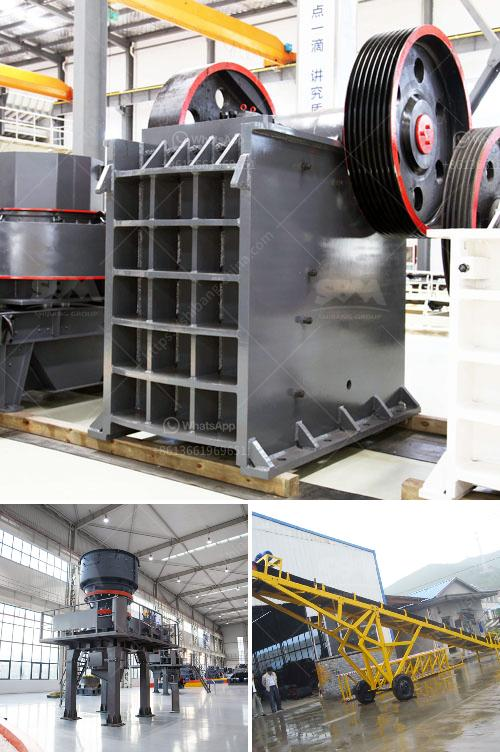

<h3>how much is a crusher mincer in malaysia</h3>
A crusher mincer is a handy kitchen appliance that can efficiently chop and grind a wide variety of ingredients. It is a must-have tool for any home cook or professional chef who wants to save time and effort in the kitchen. In Malaysia, a crusher mincer can be found in various price ranges, depending on the brand, size, and functionality. Let's explore more about the cost of a crusher mincer in Malaysia.

The price of a crusher mincer in Malaysia can range from RM50 to RM800, or even more, depending on the quality and features of the product. Basic manual crusher mincers are usually priced around RM50 to RM100. These models require you to manually turn a handle to operate the mincer. They are suitable for simple chopping tasks and are commonly made of plastic or stainless steel.

If you are looking for a higher-capacity and more efficient crusher mincer, electric models are available in the market. Electric crusher mincers come with a motor that powers the chopping mechanism, eliminating the need for manual effort. They can handle larger quantities of ingredients and offer multiple speed settings for versatile food processing. The price range for electric crusher mincers in Malaysia is usually between RM100 to RM500, depending on the brand, power, and additional features.

For those who want even more functionalities, there are crusher mincers with advanced features available in the market. These models often come with additional attachments, such as blending jugs, slicing disks, and shredding disks. They can be used for a wide range of tasks, from chopping vegetables to making smoothies or even dough. However, due to their enhanced capabilities, these crusher mincers tend to be more expensive. The price range for these advanced models can exceed RM500, depending on the brand and features provided.

When purchasing a crusher mincer in Malaysia, it is essential to consider the quality and durability of the product. Opting for reputable brands that use high-quality materials will ensure that your crusher mincer lasts longer and offers reliable performance. Additionally, it is vital to compare prices across different retailers and online platforms to find the best deal.

Online platforms and e-commerce websites often offer various discounts and promotions, allowing you to purchase a crusher mincer at a lower price. Retailers and kitchen appliance stores may also provide special offers or bundle deals that include additional accessories or warranties.

In conclusion, the cost of a crusher mincer in Malaysia can vary depending on the size, brand, and features of the product. Basic manual models are usually priced around RM50 to RM100, while electric models range from RM100 to RM500. Advanced crusher mincers with additional functionalities can exceed RM500. It is crucial to choose a product that suits your needs and budget, considering factors such as quality, durability, and additional features. By comparing prices and exploring different options, you can find a crusher mincer that offers the perfect balance between functionality and affordability.
<h3>Contact us</h3><ul><li><strong>Whatsapp:&nbsp;<a href="https://wa.me/8613661969651">+8613661969651</a></strong></li><li><a href="https://swt.shibang-china.com/?git&amp;zhl&amp;how much is a crusher mincer in malaysia"><strong>Online Service(chat now)</strong></a></li></ul><h3>Related</h3><ul><li><a href='advance stone agregate crusher equipments.md'>advance stone agregate crusher equipments</a></li><li><a href='quote for sand making machine.md'>quote for sand making machine</a></li><li><a href='crusher portable mexico stone crusher.md'>crusher portable mexico stone crusher</a></li><li><a href='small scale gold cip processing.md'>small scale gold cip processing</a></li><li><a href='stone crusher jaw 40 ton jam harga.md'>stone crusher jaw 40 ton jam harga</a></li></ul>