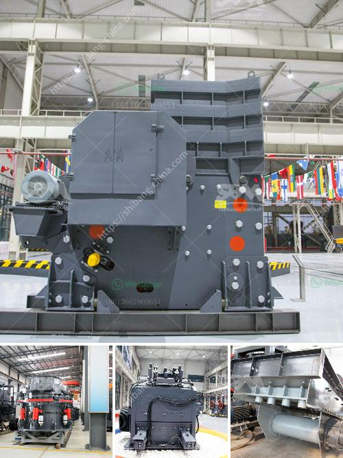

<h3>how much is a hammer mill</h3>
A hammer mill is a versatile machine used for size reduction, grinding, and pulverizing purposes. Hammer mills are widely used in various industries for processing grains, minerals, and other materials. If you are planning to purchase one, you may wonder about the cost. In this article, we will discuss how much a hammer mill typically costs.

The cost of a hammer mill can vary greatly depending on the size, capacity, and features of the machine. Generally, the price range starts from as low as $1,000 and can go up to $30,000 or even more. The cost will depend on the brand, model, and design of the hammer mill.

The size of the hammer mill is a significant factor that affects its cost. Smaller models are cheaper, while larger ones come with a higher price tag. The capacity of the machine, which refers to the amount of material it can process in a given time, also influences the cost. Hammer mills with higher capacity are typically more expensive.

Additionally, the features and specifications of the hammer mill will affect its price. Some machines come with advanced features like variable speed control, automatic feeders, and screens of different sizes for customizable grinding. These additional options add to the cost of the hammer mill.

It is worth noting that the cost of a hammer mill is not the only expense that you need to consider. You should also take into account the operational costs. Hammer mills require electricity to run, so you need to factor in the energy consumption and electricity prices in your area. Regular maintenance and replacement of parts, such as hammers and screens, should also be considered as ongoing costs.

When purchasing a hammer mill, it is essential to research different brands and models to find the one that suits your specific needs. It is advisable to compare prices from various suppliers and inquire about warranty, after-sales service, and availability of spare parts. A reliable supplier will be able to provide you with the necessary information and guide you in selecting the most cost-effective hammer mill for your requirements.

In conclusion, the cost of a hammer mill can vary depending on several factors such as size, capacity, features, and brand. It is crucial to consider both the initial investment and the ongoing operational costs when deciding on a hammer mill. Researching and comparing different options from reputable suppliers will help you make an informed decision and find the most suitable hammer mill for your needs.
<h3>Contact us</h3><ul><li><strong>Whatsapp:&nbsp;<a href="https://wa.me/8613661969651">+8613661969651</a></strong></li><li><a href="https://swt.shibang-china.com/?git&amp;zhl&amp;how much is a hammer mill"><strong>Online Service(chat now)</strong></a></li></ul><h3>Related</h3><ul><li><a href='suppliers of crusher equipment in south africa.md'>suppliers of crusher equipment in south africa</a></li><li><a href='talc powder conveying systems.md'>talc powder conveying systems</a></li><li><a href='gold sand mining machine.md'>gold sand mining machine</a></li><li><a href='dolomite powder uses in agriculture.md'>dolomite powder uses in agriculture</a></li><li><a href='limestone process plant.md'>limestone process plant</a></li></ul>