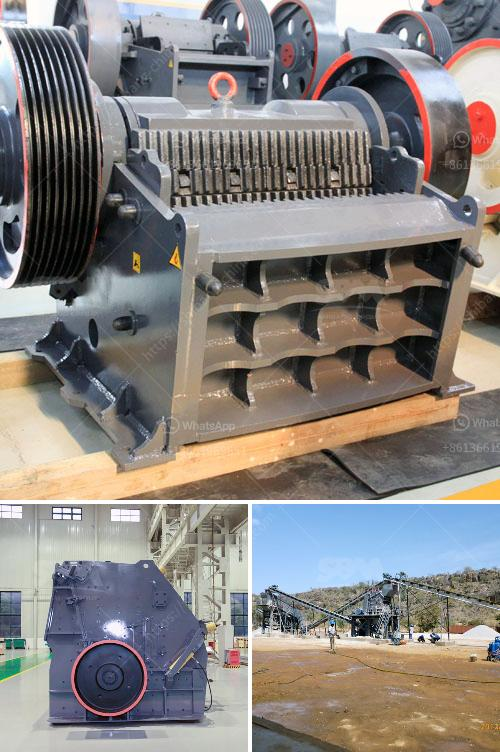

<h3>how much is a stone crusher</h3>
Crushing rocks, stones, and other materials can be a costly and time-consuming process. However, with the right equipment and expertise, you can save a significant amount of money and increase productivity by investing in a stone crusher. Stone crushers are versatile machines that can be used to crush rocks of various types and sizes, from hard granite to soft limestone. Before making any purchasing decisions, it is important to consider several factors such as the type and size of the stone crusher, the required output size, and the budget available.

The price of a stone crusher depends on various factors, including the type and capacity of the machine, required products size, desired output, and even hourly production rate. A range of stone crushers are available with different capacities, and they can be classified into two main categories: primary and secondary crushers.

Primary crushers are used to process larger rocks, usually up to 1 meter in diameter. They are designed to handle large volumes of material and are typically used in mining and quarrying applications. These crushers are powerful machines with high crushing ratios, ensuring efficient size reduction. However, they tend to be more expensive than secondary crushers due to their larger size and capacity.

Secondary crushers, on the other hand, are smaller machines that are often used in recycling and construction projects. They are designed to process smaller rocks, making them ideal for producing different grades of crushed stone. Secondary crushers are usually more affordable and easier to transport and operate compared to their primary counterparts.

The required output size is another important factor to consider when purchasing a stone crusher. Different crushers produce various sizes of crushed stone. If you require a specific product size, it is essential to choose the right machine that can deliver the desired output. For example, if you need fine-grained crushed stone for use in concrete, you might consider a jaw crusher or a cone crusher. These machines can produce smaller-sized products that meet your specific requirements.

Lastly, your budget is a crucial element when determining the price of a stone crusher. Stone crushers come in different price ranges, depending on their capabilities, sizes, and manufacturers. It is essential to set a realistic budget before buying a stone crusher to ensure that you are making a cost-efficient investment.

In conclusion, the price of a stone crusher depends on several factors, including the type and capacity of the machine, required product size, desired output, and budget. Whether you need a primary or secondary crusher, it is crucial to choose the right machine that meets your specific requirements. Investing in a stone crusher can be a worthwhile decision, as it can save you money in the long run and increase productivity.
<h3>Contact us</h3><ul><li><strong>Whatsapp:&nbsp;<a href="https://wa.me/8613661969651">+8613661969651</a></strong></li><li><a href="https://swt.shibang-china.com/?git&amp;zhl&amp;how much is a stone crusher"><strong>Online Service(chat now)</strong></a></li></ul><h3>Related</h3><ul><li><a href='crusher price of nigeria.md'>crusher price of nigeria</a></li><li><a href='hammer mill rock crusher.md'>hammer mill rock crusher</a></li><li><a href='crusher made in taiwan.md'>crusher made in taiwan</a></li><li><a href='jaw crusher for graphite.md'>jaw crusher for graphite</a></li><li><a href='small scale verticle grinding limestone machine.md'>small scale verticle grinding limestone machine</a></li></ul>