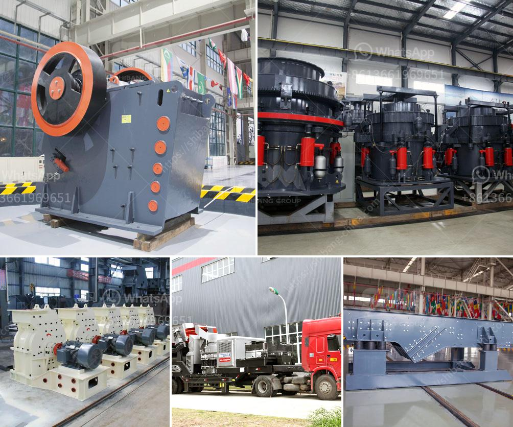

<h3>how much is ballast crusher machine in kenya</h3>
Ballast is used to pave coarse gravel or crushed stone for roads or railroads, mainly used in the construction of railroads and roadbeds across the globe. Kenya's infrastructure development is driving the demand for ballast and other construction materials. Many suppliers of ballast in Kenya are therefore targeting the lucrative market, especially with the numerous ongoing infrastructure projects.

The increased demand for ballast has led to an upsurge in the number of suppliers, making it challenging for customers to identify reliable suppliers. Furthermore, customers may also face difficulties in determining the reasonable prices for ballast crusher machines in Kenya.

To help customers overcome the challenges, SBM Group has done some research and analysis. Based on the previous experiences and market demands, SBM Group has developed a variety of ballast crusher machines with different specifications and models to meet the diverse needs of customers. The price ranges from as low as $50,000 to as high as $500,000, depending on the specific crusher model and capacity.

Both small ballast crushers and large-scale crushing machines can be available in SBM Group. The small ballast crushing machine is suitable for small and medium-sized projects and comes equipped with a vibrating feeder, jaw crusher, impact crusher, cone crusher, and vibrating screen. This machine allows for a neat end product and offers a high crushing ratio with low energy consumption.

On the other hand, the large-scale ballast crushing machine is suitable for larger projects and capable of crushing stones up to 4 feet in size. This machine comes with a unique hydraulic system for greater efficiency and consistent product size.

To summarize, the price varies depending on the size and capacity of the ballast crusher machine. SBM Group offers an extensive range of ballast crusher machines, with competitive prices, ensuring customers find the best fit for their needs. With the rapid development of infrastructure in Kenya, the ballast crusher machine is indispensable in the construction industry, contributing to the country's growth and development.
<h3>Contact us</h3><ul><li><strong>Whatsapp:&nbsp;<a href="https://wa.me/8613661969651">+8613661969651</a></strong></li><li><a href="https://swt.shibang-china.com/?git&amp;zhl&amp;how much is ballast crusher machine in kenya"><strong>Online Service(chat now)</strong></a></li></ul><h3>Related</h3><ul><li><a href='ore crushing equipment.md'>ore crushing equipment</a></li><li><a href='slag processing machine in australia.md'>slag processing machine in australia</a></li><li><a href='millia deasel grinding mill and prices.md'>millia deasel grinding mill and prices</a></li><li><a href='companies that sell conveyor belts.md'>companies that sell conveyor belts</a></li><li><a href='dolomite processing plant cost in india.md'>dolomite processing plant cost in india</a></li></ul>